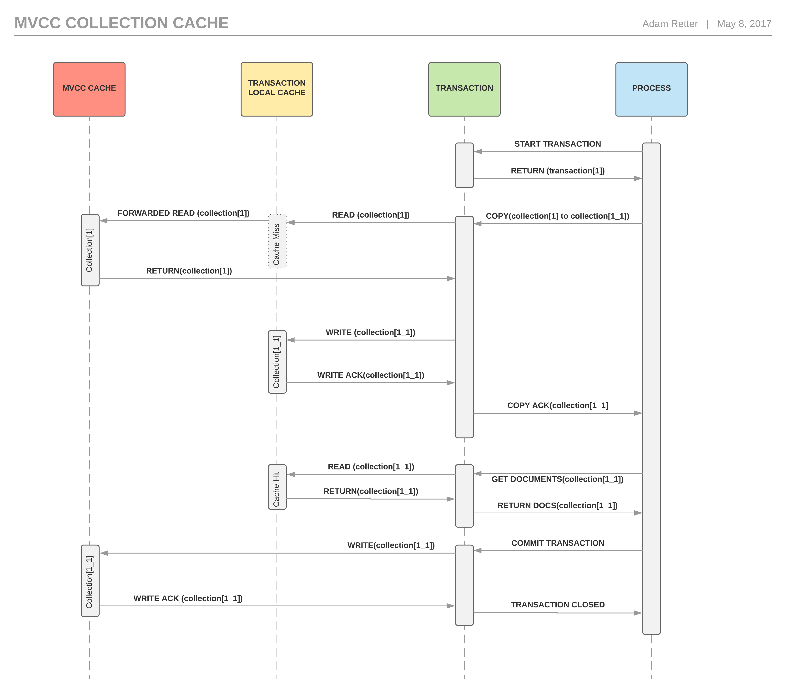
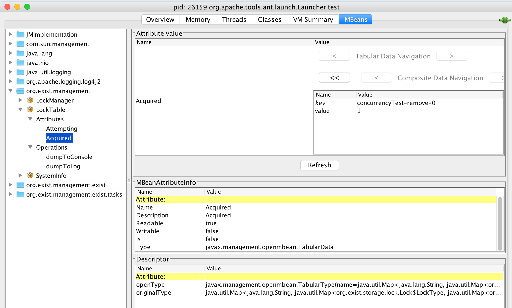
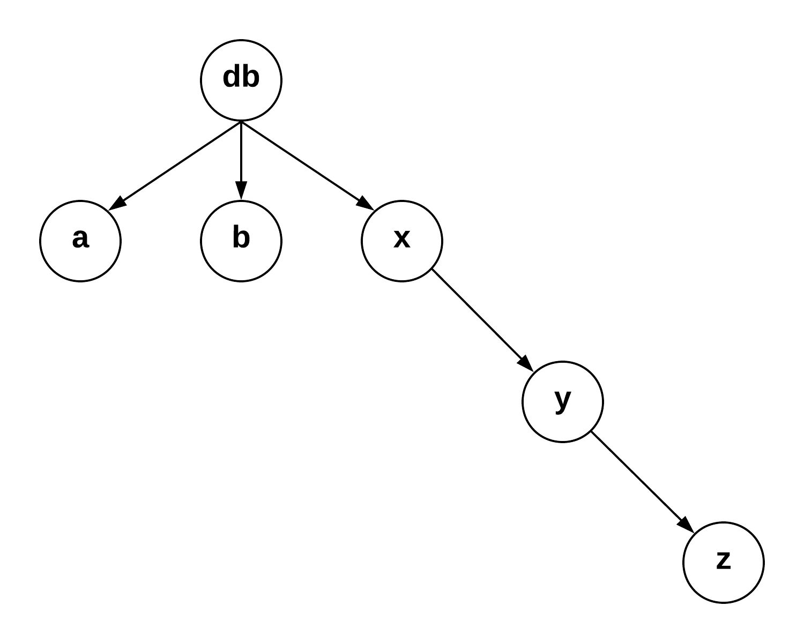
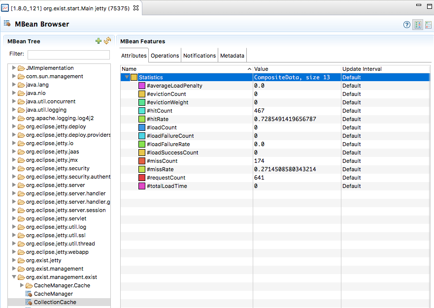

# Abstract

Since late February 2017 we ([Evolved Binary Ltd](http://www.evolvedbinary.com)) have been working on some low-level architectural changes in [eXist-db](http://www.exist-db.org) to improve concurrency, scalability, and transaction isolation. In particular we have been focused on the lock implementation used in eXist-db and how those locks are applied (i.e., the locking policy). Much of this work was inspired by the requirements for "*Granite*". Granite is an R&D project of Evolved Binary, which is exploring the next generation replacement for eXist-db.

This technical report details the problems we set out to solve, the options identified, and the choices made along the way to releasing an experimental branch of eXist-db (which contains a rewritten locking subsystem and new Collection cache): [https://github.com/evolvedbinary/exist/tree/locking-and-cache-improvements_report](https://github.com/evolvedbinary/exist/tree/locking-and-cache-improvements_report). There are also binaries available from:
[https://www.evolvedbinary.com/technical-reports/exist-db/locking-and-cache-improvements/](https://www.evolvedbinary.com/technical-reports/exist-db/locking-and-cache-improvements/). 

This study focused on eXist-db 3.2.0 at initiation, but it is still entirely valid for eXist-db 3.6.1 (which is the latest version of eXist-db at the date of publication of this report).


## Problem Statement

Granite offers true user-controllable transactions with isolation. The isolation is provided by a read-through per-transaction PUL (Pending Update List), which is layered on top of a database snapshot provided by the underlying [MVCC (Multiversion Concurrency Control)](https://en.wikipedia.org/wiki/Multiversion_concurrency_control) storage system. Whilst we are aiming for a user configurable [ACID](https://en.wikipedia.org/wiki/ACID) Isolation level, by default we are providing a level similar to [Snapshot Isolation](https://en.wikipedia.org/wiki/Snapshot_isolation), which is to say that by *default* we provide stricter isolation than PostgreSQL, SQLServer and Oracle RDBMS (Read Committed) or MySQL (Repeatable Read). For further reading on Transaction Isolation Levels see: [A Critique of ANSI SQL Isolation Levels](http://www.cs.umb.edu/cs734/CritiqueANSI_Iso.pdf).

eXist-db does not state which isolation level it supports explicitly. We know that eXist-db supports dirty reads, and as such it likely supports the lowest isolation level, i.e., [Read Uncommitted](https://en.wikipedia.org/wiki/Isolation_%28database_systems%29#Read_uncommitted). However, there is no support in eXist-db for user-controllable transactions or online transaction rollback. The "*transaction*" mechanism in eXist-db is strictly limited to applying or undoing updates based on its [WAL (Write Ahead Log)](https://en.wikipedia.org/wiki/Write-ahead_logging) for the purpose of crash recovery; the isolation level provided by eXist-db is controlled exclusively through its use of locks.

Whilst Granite’s storage system and transactions support its more rigorous isolation model, there is a blocker on our road to concurrent transaction isolation within eXist-db. eXist-db maintains a cache of Collection and Document objects (think of them as file entries, not [DOM](https://en.wikipedia.org/wiki/Document_Object_Model) objects), one in-memory object for each "object" in persistent disk storage. When a modification is made to a Collection or Document in eXist-db, this in-memory object is locked, modified, and then (eventually) serialized to disk. This cache, known as the Collection Cache, is not transaction aware and offers no isolation whatsoever; there is just a single exclusive lock for modifying its content.

The issue here for Granite is that, if we access a Collection (or Document via a Collection) object from the Collection Cache in one transaction, and modify it, then its in-memory changes are immediately reflected in all other concurrent transactions. Whilst we have achieved Snapshot Isolation and versioning of logical objects on disk, this in-memory shared state in the form of the Collection Cache completely subverts our transaction isolation.

Obviously, to ensure adherence to our transaction isolation level, we need to do something about the troublesome shared state of Collections within eXist-db's Collection Cache. Three possible solutions were identified:

1. <a name="remove-collection-cache">Remove the Collection Cache</a>

	We could simply eliminate the shared in-memory cache of Collection and Document objects. Rather than having just one Collection or Document object in-memory for each on-disk Collection or Document, we would allow each transaction to have one object for each Collection or Document that it is working with.

	Whilst this is the simplest solution to implement, it has some serious downsides. First, there will be an increase in both memory-use (which will increase as the number of concurrent transactions increases) and disk I/O (Input/Output) (as each transaction has to read in the objects it needs, even if another transaction already has done so). Second, Java incurs costs for object creation, and the subsequent garbage collection of said objects. Finally, if different processes within a transaction independently need access to the same Collection or Document, then that Collection or Document may be read from disk multiple times by the same transaction.


2. <a name="collection-cache-per-transaction">Collection Cache per Transaction</a>

	Rather than having a global shared state Collection Cache, we could move to one Collection Cache per transaction.

	This has many of the same disadvantages of [(1)](#remove-collection-cache), but it does solve the issue that if different processes within a transaction independently need access to the same Collection or Document, it only needs to be read from disk once and then they can use the same in-memory object.


3. <a name="mvcc-collection-cache">MVCC Collection Cache</a>

	We could replace eXist-db's global Collection Cache, which is simply a pair of HashMaps (and an [LRU (Least-Recently-Used)](https://en.wikipedia.org/wiki/Cache_replacement_policies#LRU) size based eviction policy enforced on put), with some sort of concurrent data structure that allows us a stable snapshot of a particular version of the cache, and updates to the cache are only made at transaction commit time.

	A complexity here which has to be accounted for, is that the objects in the cache themselves are mutable, so even if we can see the correct version of a Collection or Document in the Cache, we cannot modify it directly, otherwise that may be reflected in other concurrent transactions.
	When modifying an object retrieved from the cache, a copy of that object must first be made for our transaction, this effectively adds another cache layer which is "*transaction local*". Subsequently, when the transaction wishes to work with the object, it must consult its transaction local cache first, before falling back to reading from the MVCC cache. When the transaction commit succeeds, the transaction-local version is added to the MVCC cache. In the case of an abort, it is simply abandoned. Whether the transaction-local cache is a completely separate cache, or a transaction specific version within the global cache is left as an implementation detail.

	This approach is certainly the most complicated of the three to implement. It allows for a global shared cache in which all transactions read from and only write a new version to the cache at commit time. It also allows a transaction to read-and-write to a locally cached copy should the transaction need to perform any writes to an object. This should allow us to keep the amount of in-memory objects and reads from disk to a minimum, whilst allowing us to share immutable state.

	

Always aiming for the best solution with Granite, we decided to implement an [MVCC aware Collection Cache (3)](#mvcc-collection-cache), which ultimately means replacing eXist-db's Collection Cache with something better suited to the transactional nature of Granite. However, whether we choose to replace the Collection Cache ([(2)](#collection-cache-per-transaction) or [(3)](#mvcc-collection-cache)) or [remove the Collection Cache (1)](#remove-collection-cache)), we discovered a <a href="sync-collections-cache" title="Mutually Exclusive synchronization on the Collections Cache">serious architectural limitation</a> which has to be addressed first.

Before explaining the solution of the shared mutable Collection Cache state issue for Granite we provide some insight into how the locking currently works in eXist-db 3.2.0 to give the reader a foundation for understanding the locking and architectural issues we encountered in eXist-db.


## <a name="locking-in-exist">Locking in eXist-db 3.2.0</a>
There are two main types of locks used in eXist-db: Collection Locks and Document Locks. Both provide [shared-exclusive](https://en.wikipedia.org/wiki/Readers–writer_lock) modes, which allows us to lock for *READ* (shared) or *WRITE* (exclusive). However, these locks are not the [standard locks](https://docs.oracle.com/javase/8/docs/api/java/util/concurrent/locks/Lock.html) available in Java SE 8, so they may not, in fact, function in the same manner as a Java developer may expect. In detail:

1. <a name="collection-locks">Collection Locks</a>

	Collections in eXist-db are very similar to folders on a file-system: they act as physical containers of Documents. Access to a persistent Document in the database is always through one Collection (or several). Even when the URI of a Document in the database is known in advance, we still need to read the Document from its container Collection.

	Internally, eXist-db attempts to maintain one [`MutableCollection`](https://github.com/eXist-db/exist/blob/eXist-3.2.0/src/org/exist/collections/MutableCollection.java) object in-memory for each Collection in the database. Apart from the root Collection `/db`, these Collection objects are lazily-loaded as they are accessed by the user by reading their information from the `collections.dbx` file on disk. When the Collection object is loaded it also reads in the document entry information (name, permissions, metadata, etc.) for each document in the Collection and creates a map of [`DocumentImpl`](https://github.com/eXist-db/exist/blob/eXist-3.2.0/src/org/exist/dom/persistent/DocumentImpl.java) objects which represent the documents in the Collection.

	The ability to keep all Collection objects in memory is governed by the [CollectionCache](https://github.com/eXist-db/exist/blob/eXist-3.2.0/src/org/exist/collections/CollectionCache.java) which provides a finite but configurable amount of space based storage using a [LRU](https://en.wikipedia.org/wiki/Cache_replacement_policies#LRU) eviction policy.

	Every persistent Collection in the database when in-memory has an [associated lock object](https://github.com/eXist-db/exist/blob/eXist-3.2.0/src/org/exist/collections/MutableCollection.java#L89). This lock object is implemented in [`org.exist.storage.lock.
	ReentrantReadWriteLock`](https://github.com/eXist-db/exist/blob/eXist-3.2.0/src/org/exist/storage/lock/ReentrantReadWriteLock.java).

	Collection Locks are used both to protect the internal state of the `Collection` objects and to prevent concurrent users from modifying simultaneously the same Collection in the persistent storage file `collections.dbx`.

	The behaviour of this lock is quite different from [`java.util.concurrent.locks.
	ReentrantReadWriteLock`](https://docs.oracle.com/javase/8/docs/api/java/util/concurrent/locks/ReentrantReadWriteLock.html) in Java SE 8. In fact, eXist-db's lock is closer to a mutually exclusive lock such as [`java.util.concurrent.locks.ReentrantLock`](https://docs.oracle.com/javase/8/docs/api/java/util/concurrent/locks/ReentrantLock.html), having these three properties:

	  1. Exclusive.
	  Single Reader or Single Writer thread; whilst it records a `READ_LOCK` or `WRITE_LOCK` mode, there is no shared lock.

	  2. Reentrant.

	  3. Allows Lock upgrading, i.e.: `READ_LOCK` -> `WRITE_LOCK`.

	This lock implementation appears to be a modified version of [`EDU.oswego.cs.dl.
	util.concurrent.ReentrantLock`](http://gee.cs.oswego.edu/dl/classes/EDU/oswego/cs/dl/util/concurrent/ReentrantLock.html) by [Doug Lea](https://en.wikipedia.org/wiki/Doug_Lea). The modifications add the facility for recording and retrieving the *intended* lock mode, but it still remains a mutually exclusive lock.

2. <a name="document-locks">Document Locks</a>

	Internally eXist-db uses a lazy loaded DOM model to work with nodes. For example, when you work with a persistent document from the database via [`fn:doc`](https://www.w3.org/TR/xpath-functions-31/#func-doc) (or even [`fn:collection`](https://www.w3.org/TR/xpath-functions-31/#func-collection), a [`DocumentImpl`](https://github.com/eXist-db/exist/blob/eXist-3.2.0/src/org/exist/dom/persistent/DocumentImpl.java) object is accessed from the appropriate `MutableCollection` object. As nodes within the document are requested from the `DocumentImpl` DOM object, these are loaded on demand from the `dom.dbx` file on disk, and appropriate `org.exist.dom.persistent.*` DOM objects are created.

	Every persistent Document in the database has an [associated lock object](https://github.com/eXist-db/exist/blob/eXist-3.2.0/src/org/exist/dom/persistent/DocumentImpl.java#L114) which is lazily initialized for its `DocumentImpl` object representation as needed. This lock object is implemented in [`org.exist.storage.lock.MultiReadReentrantLock`](https://github.com/eXist-db/exist/blob/eXist-3.2.0/src/org/exist/storage/lock/MultiReadReentrantLock.java).

	Document Locks are used to protect the internal state of the `DocumentImpl` objects. They are also used to prevent concurrent users from simultaneously modifying the same document entry (name, permissions, metadata, etc.), and the document's nodes, held in the persistent storage files `collections.dbx` and `dom.dbx` respectively.

	The behaviour of this lock is similar to [`java.util.concurrent.locks.
	ReentrantReadWriteLock`](https://docs.oracle.com/javase/8/docs/api/java/util/concurrent/locks/ReentrantReadWriteLock.html) in Java SE 8: it allows multiple-reader threads or a single-writer thread, and supports reentrancy. However, it differs in that:
	  
	  1. It is Writer biased, i.e., waiting writers are preferred over waiting readers.

	  2. It allows Lock upgrading, i.e.: `READ_LOCK` -> `WRITE_LOCK`.

	This lock implementation appears to have been originally based on an implementation found in the [Apache Turbine JCS](https://wiki.apache.org/turbine/) project.


There are also several other ancillary locks that are used in eXist-db when interacting with Documents and Collections. Briefly these are:

1. Exclusive intrinsic lock on the Collection Cache object, i.e.: `synchronized(collectionCache)`.

2. An [`org.exist.storage.lock.ReentrantReadWriteLock`](https://github.com/eXist-db/exist/blob/eXist-3.2.0/src/org/exist/storage/lock/ReentrantReadWriteLock.java) is used to control concurrent access to the `dom.dbx` file.

3. An [`org.exist.storage.lock.ReentrantReadWriteLock`](https://github.com/eXist-db/exist/blob/eXist-3.2.0/src/org/exist/storage/lock/ReentrantReadWriteLock.java) is used to control concurrent access to the `collections.dbx` file.


## <a name="locking-problems-in-exist">Problems with Locking in eXist-db</a>

As well as experiencing problems with locking in eXist-db either first-hand or indirectly through helping users solve problems such as [deadlocks](https://en.wikipedia.org/wiki/Deadlock), we have also spent a significant amount of time studying and reviewing the locking code itself. From these experiences and direct analysis we believe we have identified a number of problems with locking in eXist-db:

1. Inconsistent Use of Locks

	Internally eXist-db takes a very inconsistent approach to locking. These problems fall into two categories: 1) developer mistakes and 2) unsafe design. If we ignore the first category which is more easily solved, and focus on the latter category of unsafe design, we can see that classes like `org.exist.collections.Collection` make it very difficult to work with a Collection in a safe manner. Consider this code excerpt from [`MuatbleCollection.java`](https://github.com/eXist-db/exist/blob/eXist-3.2.0/src/org/exist/collections/MutableCollection.java#L89):

	```java
	private final Lock lock;
	...
	private Permission permissions;
	...

	@Override
	public Lock getLock() {
	    return lock;
	}
	...

	@Override
	final public Permission getPermissions() {
	    try {
	        getLock().acquire(LockMode.READ_LOCK);
	        return permissions;
	    } catch(final LockException e) {
	        LOG.error(e.getMessage(), e);
	        return permissions;
	    } finally {
	        getLock().release(LockMode.READ_LOCK);
	    }
	}

	@Override
	public Permission getPermissionsNoLock() {
	    return permissions;
	}

	@Override
	public void setPermissions(final int mode) throws LockException, PermissionDeniedException {
	    try {
	        getLock().acquire(LockMode.WRITE_LOCK);
	        permissions.setMode(mode);
	    } finally {
	        getLock().release(LockMode.WRITE_LOCK);
	    }
	}

	@Override
	public void setPermissions(final Permission permissions) throws LockException {
	    try {
	        getLock().acquire(LockMode.WRITE_LOCK);
	        this.permissions = permissions;
	    } finally {
	        getLock().release(LockMode.WRITE_LOCK);
	    }
	}
	```

	Looking at the above code it is very difficult to understand how we should work with Collection Permissions in a safe manner. Several issues exist:

	1. There are functions that imply access without locking and others which do lock. This raises the question in the mind of the consumer, of which should be used, and when?
	2. `Collection#getPermissions()` and `Collection#getPermissionsNoLock()` both *allow internal mutable state to **escape***. So whether we use the lock method or the non-locking method, once a thread has a reference to the `Permissions` object, it may directly modify its state. For an in-depth explanation see (see: [JCIP](https://www.amazon.com/gp/product/0321349601?ie=UTF8&tag=none0b69&linkCode=as2&camp=1789&creative=9325&creativeASIN=0321349601) §3.2).
	3. Memory visibility. If we call either `#setPermisions(...)` functions we can see that a lock will be used to update the internal reference, but if another thread were to call `#getPermissionsNoLock()` there is no guarantee that they would see the updated permissions object, because no synchronization was used<sup>[1](#collection-thread-safe-exeption)</sup>.
	4. <a name="invariant-compound-unsafe"/>Invariant operations and compound operations are not thread-safe<sup>[1](#collection-thread-safe-exeption)</sup> as locks are taken and released between operations, and do not guard the published state! E.g.:
	```java
	if(collection.getPermissions().getOwner().getName().equals("Bob"))) {
		collection.getPermissions().setOwner(newOwner);
	}
	```

	<a name="collection-thread-safe-exeption"><sup>1</sup></a> Unless the involved threads have already locked (or are attempted to Lock) the Collection appropriately by using `Collection#getLock()` etc.

	So how should one work with Collection objects safely? The JavaDoc for [`Collection.java`](https://github.com/eXist-db/exist/blob/eXist-3.2.0/src/org/exist/collections/Collection.java#L40) says:

	> Collections are shared between {@link org.exist.storage.DBBroker} instances. The caller
	> is responsible to lock/unlock the collection. Call {@link DBBroker#openCollection(XmldbURI, LockMode)}
	> to get a collection with a read or write lock and {@link #release(LockMode)} to release the lock.

	So it seems that when working with a Collection we should ensure that we hold the appropriate lock. If that is indeed the case, then what are we to make of the `Collection#getPermissions()` and `Collection#getPermissionsNoLock()` functions?

	We assert that, the current implementation of the `Collection`/`MutableCollection` class by design allows, and maybe even encourages, developers to violate the documented contract.

	Historically we can see that unsafe publication of `Permissions` objects from `Collection` was added as a mechanism for removing a deadlock in commit [e4af5d7](https://github.com/eXist-db/exist/commit/e4af5d782a91df805f2a75bf332ef0dd980f2446). However, it likely introduced concurrency bugs where multiple threads can simultaneously modify or read stale permissions for a Collection, leading to inconsistent permissions on Collections.

	In the opinion of the authors of this article, it is likely that the JavaDoc is correct and the implementation is wrong. As Collections are complex objects in eXist-db, often upon which many compound operations must be sequentially performed in a serializable fashion, it must surely be the responsibility of the *caller* to take the appropriate lock when they first access the Collection, and then hold the lock until they have completed their compound operation, at which point they should release it. As such our above, compound operation in [(4)](#invariant-compound-unsafe) would rather look like:

	```java
	Lock collectionLock = null;
	try {
		collectionLock = collection.getLock().acquire(LockMode.WRITE_LOCK);
		if(collection.getPermissions().getOwner().getName().equals("Bob"))) {
			collection.getPermissions().setOwner(newOwner);
		}
	} finally {
		if(collectionLock != null) {
			collection.getLock().release(LockMode.WRITE_LOCK);
		}	
	}
	```

	Further work in this area is discussed in the future work item [Externalise Collection Locking](#externalise-collection-locking).

2. <a name="inconsistent-lock-interleaving">Inconsistent Lock Interleaving</a>
	
	Examining the eXist-db source code, we can see several different interleaving patterns for varying lock types. Some of the identified patterns:

	1. Collection Acquire, Document Acquire, Collection Release, Document Release

		[`MuatbleCollection#addBinaryResource(...)`](https://github.com/eXist-db/exist/blob/eXist-3.2.0/src/org/exist/collections/MutableCollection.java#L1654)

		```java
		public BinaryDocument addBinaryResource(final Txn transaction, final DBBroker broker, final BinaryDocument blob,
		        final InputStream is, final String mimeType, final long size, final Date created, final Date modified)
		        throws EXistException, PermissionDeniedException, LockException, TriggerException, IOException {

	        ...

	        getLock().acquire(LockMode.WRITE_LOCK);
	        try {

	        	...

	        	blob.getUpdateLock().acquire(LockMode.READ_LOCK);
	        } finally {
        		...
        		getLock().release(LockMode.WRITE_LOCK);
	        }
	        try {
	            ...
	        } finally {
	            blob.getUpdateLock().release(LockMode.READ_LOCK);
	        }
	        return blob;
        }
		```

	2. Collection Acquire, Document Acquire, Document Release, Collection Release

		[`MuatbleCollection#removeBinaryResource(...)`](https://github.com/eXist-db/exist/blob/eXist-3.2.0/src/org/exist/collections/MutableCollection.java#L1064)

		```java
		public void removeBinaryResource(final Txn transaction, final DBBroker broker, final DocumentImpl doc)
            	throws PermissionDeniedException, LockException, TriggerException {

            getLock().acquire(LockMode.WRITE_LOCK);

            try {

            	if(doc.getResourceType() != DocumentImpl.BINARY_FILE) {
	                throw new PermissionDeniedException("document " + doc.getFileURI() + " is not a binary object");
	            }
	            
	            ...
	            
	            doc.getUpdateLock().acquire(LockMode.WRITE_LOCK);

			} finally {
            	...
            	doc.getUpdateLock().release(LockMode.WRITE_LOCK);
            	getLock().release(LockMode.WRITE_LOCK);
        	}

        }
        ```

        It is also worth noting above that the calls to `DocumentImpl#getResourceType()` and `DocumentImpl#getFileURI()` are not synchronized in any way, and so may dangerously read stale data, or allow the document removal to occur concurrently with another thread which is changing the Document’s resource type, which may have otherwise prevented the removal.

	3. synchronized(ProcessMonitor), Collection Acquire, Collection Release, synchronized(ProcessMonitor)

		[`NativeBroker#copyCollection(...)`](https://github.com/eXist-db/exist/blob/eXist-3.2.0/src/org/exist/storage/NativeBroker.java#L1078)

		```java
		final Lock lock = collectionsDb.getLock();
        try {
            pool.getProcessMonitor().startJob(ProcessMonitor.ACTION_COPY_COLLECTION, collection.getURI());
            lock.acquire(LockMode.WRITE_LOCK);

            ...

        } finally {
            lock.release(LockMode.WRITE_LOCK);
            pool.getProcessMonitor().endJob();
        }
		```

	4. synchronized(ProcessMonitor), Collection Acquire, synchronized(ProcessMonitor), Collection Release

		[`MutableCollection#removeXMLResource(...)`](https://github.com/eXist-db/exist/blob/eXist-3.2.0/src/org/exist/collections/MutableCollection.java#L1000)

		```java
		db.getProcessMonitor().startJob(ProcessMonitor.ACTION_REMOVE_XML, name);
        getLock().acquire(LockMode.WRITE_LOCK);

        try {

        	...

        } finally {
            broker.getBrokerPool().getProcessMonitor().endJob();
            ...
            getLock().release(LockMode.WRITE_LOCK);
        }
		```

	One of the key axioms in developing concurrent code that avoids deadlocks is to ensure that locks are always taken in the same order and released in the same order. Interleaving the acquire/release of different lock types itself is not a problem, as long as it is consistent, i.e., there is only one pattern. When we have multiple patterns, we break the axiom and deadlocks are almost certainly assured by design.

	One solution to this problem would be to establish a single pattern for each group of different lock types that we work with, so as to ensure that acquisition/release always happens in the same order.

	Determining which pattern is correct is not a simple task, and is currently undocumented in eXist-db. We identify the correct pattern and discuss its implementation in [Collection and Document Lock Ordering](#collection-document-lock-ordering).

3. <a name="incorrect-lock-modes">Use of Incorrect Lock Modes - Shared vs. Exclusive</a>

	Whilst this class of problems is almost certainly caused by developer error, design can also cause confusion if interfaces and their locking requirements are not properly documented and made explicit.

	If a Shared (READ) lock is taken when writing to shared mutable state (instead of the necessary Exclusive (WRITE) lock), then there is no guarantee whether concurrent reading threads will see stale or current data.

	If an Exclusive (WRITE) lock is taken when reading shared mutable state, whilst there are data inconsistency concerns, the desirable concurrent operation of the function is eliminated.

	The actual use of incorrect lock modes in eXist-db (as of version 3.2.0) will not cause problems with respect to Collections, since their locks are currently solely exclusive. However, incorrect modes will certainly cause problems with Documents that have shared-exclusive locks.

	Several such issues were identified and fixed in: [PR 1295](https://github.com/eXist-db/exist/pull/1295/commits).

	In addition, to reduce such issues in future, we discuss and provide a new mechanism in [Ensure Locking Annotations](#ensure-locking-annotations) to help document and enforce locking contracts.

4. <a name="lock-leaks">Lock Leaks</a>

	eXist-db has no facility for managing the lifetime of a lock. Unfortunately this means that if a lock is taken on an Object and the developer makes the error of failing to release the lock, then that object will never be unlocked.

	If the leaked lock was a shared lock then the Object still remains available for reads, but will never become available for writes. If the leaked lock was an exclusive lock, then the Object will not be available for reads, and will only be available for writes if the thread is recycled and used by a different query. Either way, leaked locks can block concurrent threads which attempt to access the locked object.

	We previously identified and fixed several such issues in: [PR 1418](https://github.com/eXist-db/exist/pull/1418/commits).

	To solve such issues by design, we discuss and provide a new mechanism in [ManagedLock](#managed-locks)s to help eliminate leaks.

5. <a name="accidental-lock-release">Accidental Lock Release</a>

	Perhaps worse than leaking a Lock is releasing a lock which you never acquired. Whilst locks must be released by the thread that owned them, because Locks are re-entrant a single thread may have many *holds* on a lock.

	Within a single thread, if a function releases a lock which it did not acquire, then this can have disastrous consequences. Assuming that we already hold a lock on an object, if we were to release a lock and our hold count is `1`, then this makes the object available to other threads for concurrent modification or reading, whereas our thread’s code may assume that we still have synchronized access and likewise may modify or read the object. If the hold count is `> 1` it will be decremented, but unless we also have a lock leak, then we will still eventually get the same outcome.

	Also, of note, some Lock implementations (e.g., Java's) will throw an exception if you try to release a lock when the hold-count is zero, which could lead to unexpected crashes. However, that is probably preferable to eXist-db's locks, which simply mask the underlying issue and thereby prevent the developer from analysing the underlying problem and hopefully fixing it.

	We previously identified and fixed several such issues in commit [f6f3b85](https://github.com/eXist-db/exist/pull/1418/commits/f6f3b85c0178d4e41e79a5c8c2ad73b040d0a525).

	Such issues, may also be solved through the use of our new [ManagedLock](#managed-locks)s, and possibly diagnosed with our [Ensure Locking Annotations](#ensure-locking-annotations), which we later discuss.

6. <a name="insufficient-locking">Insufficient Locking</a>
	
	We have already briefly seen some examples where not enough locking is done to ensure consistency when concurrently accessing Collections. Let’s take another example:

	[`NativeBroker#openCollection(...)`](https://github.com/eXist-db/exist/blob/eXist-3.2.0/src/org/exist/storage/NativeBroker.java#L921)

	```java
	private Collection openCollection(XmldbURI uri, final long address, final LockMode lockMode)
	        throws PermissionDeniedException {

        ...

        synchronized(collectionsCache) {
        	collection = collectionsCache.get(uri);
        	if(collection == null) {

        		...

        	} else {
            	if(!collection.getURI().equalsInternal(uri)) {
                    LOG.error("The collection received from the cache is not the requested: " + uri +
                        "; received: " + collection.getURI());
                }
                collectionsCache.add(collection);

                if(!collection.getPermissionsNoLock().validate(getCurrentSubject(), Permission.EXECUTE)) {
                    throw new PermissionDeniedException("Permission denied to open collection: " + collection.getURI().toString() + " by " + getCurrentSubject().getName());
                }
        	}
        }

        //Important : 
        //This code must remain outside of the synchronized block
        //because another thread may already own a lock on the collection
        //This would result in a deadlock... until the time-out raises the Exception
        //TODO : make an attempt to an immediate lock ?
        //TODO : manage a collection of requests for locks ?
        //TODO : another yet smarter solution ?
        if(lockMode != LockMode.NO_LOCK) {
            try {
                collection.getLock().acquire(lockMode);
            } catch(final LockException e) {
                LOG.warn("Failed to acquire lock on collection '" + uri + "'");
            }
        }
        return collection;
	}
	```

	Looking at the above code, reading the comments may lead one to believe that the locking in this function has been thoughtfully tested to be correct, and that the `//TODO` are merely suggesting better options.

	Unfortunately the locking integrity in this function is flawed. The code’s `else` branch makes several reads of the mutable shared state of Collection without any locking at all. This could cause a mix of stale and current data to be read, which makes the assertions unreliable at best. It also calls `CollectionCache#add(Collection)` in an attempt to increment the [LRU](https://en.wikipedia.org/wiki/Cache_replacement_policies#LRU) for the Collection. However, there is no guarantee that another thread has not pre-empted ours and modified the Collection object, which causes not only a failure to update the relevant [LRU](https://en.wikipedia.org/wiki/Cache_replacement_policies#LRU), but potentially the addition of a different Collection state to the cache.

	Whilst the comments in the code are correct, that moving the locking inside the synchronized block may cause a deadlock, there is no other option here if we are to ensure the safe concurrent use of Collections. Any such arising deadlock could be solved by either:  (a) ensuring that the intrinsic lock on the CollectionCache (i.e.: `synchronized`) and Collection Locks are always acquired and then released in the same order when used together in the code base, or (b) switching to some sort of lock-free data structure for the CollectionCache.

	There should be no unlocked access to Collection's internal state, we provide a mechanism to assist in resolving this issue in the form of our [Ensure Locking Annotations](#ensure-locking-annotations).

	Unfortunately by design, the ability to read Collections and Documents in a non-consistent (i.e., **unsafe**) manner in eXist-db is further compounded by having a special lock mode named [`NO_LOCK`](https://github.com/eXist-db/exist/blob/eXist-3.2.0/src/org/exist/storage/lock/Lock.java#L31). Passing `LockMode.NO_LOCK` to eXist-db's locks for *acquire* or *release* effectively bypassing any locking; one particularly striking example of this is [`NativeBroker#getCollection(XmldbURI)`](https://github.com/eXist-db/exist/blob/eXist-3.2.0/src/org/exist/storage/NativeBroker.java#L812), which is used from many locations in the eXist-db code base and acquires a reference to a Collection object for the caller without any locking whatsoever. The caller then often goes on to read the shared mutable state of the Collection with no further locking, e.g., [`PermissionsFunction#getPermissions(XmldbURI)`](https://github.com/eXist-db/exist/blob/eXist-3.2.0/src/org/exist/xquery/functions/securitymanager/PermissionsFunction.java#L411):

	```java
	private Permission getPermissions(final XmldbURI pathUri) throws XPathException, PermissionDeniedException {
        final Permission permissions;
	    final Collection col = context.getBroker().getCollection(pathUri);
        if(col != null) {
            permissions = col.getPermissionsNoLock();
        } else {
        	...
        }
        return permissions;
	```

	For further consideration of `LockMode.NO_LOCK`, see the future work item [Eliminate the erroneous `LockMode.NO_LOCK`](#elmiminate-nolock).

	<a name="insufficient-locking-collections-cache">A final example</a> of insufficient locking is access to the [`CollectionCache`](https://github.com/eXist-db/exist/blob/eXist-3.2.0/src/org/exist/collections/CollectionCache.java). The `CollectionCache` is used solely by `NativeBroker`, which mostly enforces a rather rigid (even overzealous) mutual exclusion access policy:

	```java
	final CollectionCache collectionsCache = pool.getCollectionsCache();
    synchronized(collectionsCache) {
    	...
    }
	```

	However, access to the Collection Cache in [`NativeBroker#saveCollection(...)`](https://github.com/eXist-db/exist/blob/eXist-3.2.0/src/org/exist/storage/NativeBroker.java#L1718) is missing any synchronization at all:

	```java
	@Override
    public void saveCollection(final Txn transaction, final Collection collection) throws PermissionDeniedException, IOException, TriggerException {
        if(collection == null) {
            LOG.error("NativeBroker.saveCollection called with collection == null! Aborting.");
            return;
        }
        if(isReadOnly()) {
            throw new IOException(DATABASE_IS_READ_ONLY);
        }

        pool.getCollectionsCache().add(collection);
	```

	This is very dangerous; this single un-synchronized write access by itself is potentially destructive and completely eliminates any safety provided by the synchronization used at other sites of access to the Collection Cache.

	We address this issue in our larger piece of work where we remove the need for synchronized access to the Collections Cache, see the section [Replacing the Collection Cache](#replacing-the-collection-cache).


7. Overzealous Locking

	Locks in eXist-db are re-entrant which allows them to be acquired many times by the same thread. Acquiring a lock (even if it is un-contended) has a high cost involved. Re-acquiring the same lock also has a cost, albeit not as high. When we already hold a lock it is more performant to not attempt to re-acquire the lock, obviously this can only be done if the developer is fully aware that their code has already acquired the lock upstream.

	Unfortunately in eXist-db there are code paths which are sub-optimal in this way. When a developer calls a public function, that function may acquire a lock and then make many sub-function calls which also re-acquire the same lock.
	One such concrete example is that of [`MutableCollection#allDocs(...)`](https://github.com/eXist-db/exist/blob/eXist-3.2.0/src/org/exist/collections/MutableCollection.java#L389):

	```java
	@Override
    public MutableDocumentSet allDocs(final DBBroker broker, final MutableDocumentSet docs, final boolean recursive,
            final LockedDocumentMap lockMap) throws PermissionDeniedException {
        List<XmldbURI> subColls = null;
        if(getPermissionsNoLock().validate(broker.getCurrentSubject(), Permission.READ)) {
            try {
                getLock().acquire(LockMode.READ_LOCK);
                try {
                    //Add all docs in this collection to the returned set
                    getDocuments(broker, docs);

                    ...

	@Override
    public DocumentSet
    getDocuments(final DBBroker broker, final MutableDocumentSet docs)
            throws PermissionDeniedException, LockException {
        ...
        
        try {
            getLock().acquire(LockMode.READ_LOCK);
            docs.addCollection(this);
            addDocumentsToSet(broker, docs);
        } finally {
            getLock().release(LockMode.READ_LOCK);
        }
        
        return docs;
    }

    ...

    private void addDocumentsToSet(final DBBroker broker, final MutableDocumentSet docs) {
    	try {
            for (final DocumentImpl doc : copyOfDocs()) {
                if (doc.getPermissions().validate(broker.getCurrentSubject(), Permission.READ)) {
                    docs.add(doc);
                }
            }
        } catch(final LockException e) {
            LOG.error(e);
        }
    }

    ...

    private List<DocumentImpl> copyOfDocs() throws LockException {
        getLock().acquire(LockMode.READ_LOCK);
        try {
            return new ArrayList<>(documents.values());
        } finally {
            getLock().release(LockMode.READ_LOCK);
        }
    }
	```

	From the call-graph of `allDocs` -> `getDocuments` -> `addDocumentsToSet` -> `copyOfDocuments` we can see that the same READ lock on the collection lock is acquired three times, when actually it only needs to be acquired once in `allDocs`. Some refactoring of this code could reduce the number of lock re-acquisitions, or better yet, some re-design of Collection locking itself would likely yield a better result.

	Rather than directly refactoring `MutableCollection#allDocs`, a better scheme as previously mentioned, would be to entirely externalize the Collection locking from the Collection objects. For a further discussion see the future work item [Externalise Collection Locking](#externalise-collection-locking).
	
	Another consideration is that at present every Collection object in eXist-db has its own associated lock object. This means that if we want to work with a hierarchy of collections, for example moving the Collection `/db/a/b` (where `b` has children `c1` and `c2`) to the Collection`/db/x/y/z`, then we acquire exclusive locks on Collections: `/db/a`, `/db/a/b`, `/db/a/b/c1`, `/db/a/b/c2` and `/db/z`. A potential saving would be to work with hierarchical locks, in this manner we would only need to acquire write locks on `/db/a` and `/db/x/y/z`. This is a considerable saving, and unlike the current scheme, stays linear regardless of the number of Collections added to the database.

	We address this issue in our larger piece of work where we investigate hierarchical locking schemes for Collection deadlock avoidance. See the section [Collection Deadlock Avoidance Locking Schemes](#collection-deadlock-avoidance-locking-schemes).

8. <a name="correctness-of-locks">Correctness of Lock Implementations</a>

	1. Collection Locks

		Examining the [`org.exist.storage.lock.ReentrantReadWriteLock`](https://github.com/eXist-db/exist/blob/eXist-3.2.0/src/org/exist/storage/lock/ReentrantReadWriteLock.java) lock implementation used for [Collection Locks](#collection-locks) in eXist-db, the exact provenance of the code is not entirely discernible, but the Copyright header indicates that it was originally taken from Doug Lea's `ReentrantLock.java`:

		> 		*
		> 		* File: ReentrantLock.java
		>		*
		>		* Originally written by Doug Lea and released into the public domain.
		>		* This may be used for any purposes whatsoever without acknowledgment.
		>		* Thanks for the assistance and support of Sun Microsystems Labs,
		>		* and everyone contributing, testing, and using this code.
		>		*

		Although the implementation seems to differ significantly from the final 1.3.4 version release by Doug Lea, we currently have no reason to doubt the changes made by the eXist-db project; as no direct issues with the lock implementation have been reported. More worrying perhaps is [this statement from Doug Lea](http://gee.cs.oswego.edu/dl/classes/EDU/oswego/cs/dl/util/concurrent/intro.html):

		> Note: Upon release of J2SE 5.0, this package enters maintenance mode: Only essential corrections will be released. J2SE5 package `java.util.concurrent` includes improved, more efficient, standardized versions of the main components in this package. Please plan to convert your applications to use them.

	2. Document Locks

		Examining the [`org.exist.storage.lock.MultiReadReentrantLock`](https://github.com/eXist-db/exist/blob/eXist-3.2.0/src/org/exist/storage/lock/MultiReadReentrantLock.java) lock implementation used for [Document Locks](#document-locks) in eXist-db, again does not reveal the exact provenance. The license header shows that the "*original code*" is licensed under the Apache 2 license and the JavaDoc comments state:

		> This is an adapted and bug-fixed version of code taken from Apache's Turbine
		> JCS.

 		Unfortunately no further information can be found about where the implementation was taken from, or what "*bug-fixed*" constitutes. The code is no longer used within any Apache project, and [Turbine](https://turbine.apache.org/) JCS has split off into [Apache Commons JCS](https://commons.apache.org/proper/commons-jcs/).

 		Similarly, to Collection Locks, no direct issues have been reported with the Document lock implementation to the eXist-db project, and so there is currently no reason to doubt the validity of this implementation. *Caveat emptor*, Java SE's shared-exclusive lock [ReentrantReadWriteLock](https://docs.oracle.com/javase/8/docs/api/java/util/concurrent/locks/ReentrantReadWriteLock.html) does not support lock upgrading as it is deadlock prone, but intriguingly `MultiReadReentrantLock` does seemingly allow this. Further research would be required to guarantee that `MultiReadReentrantLock` does not exhibit problems with lock upgrading or other phenomena.

 	In summary, because the provenance and correctness of eXist-db's lock implementations cannot be determined, it would seem appropriate to consider replacing them with the standard `ReentrantLock` and `ReentrantReadWriteLock` locks built into Java SE. It is also possible that the performance of Doug Lea's original work has been improved upon in more recent iterations within Java SE. In addition the JVM also includes some limited support for deadlock detection which is missing from eXist-db's lock implementations. If moving to the standard Java SE locks is not desirable for some reason (perhaps the lack of lock upgrading support) then, at the least the implementations in eXist-db must be proven correct; a tool such as [jcstress](http://openjdk.java.net/projects/code-tools/jcstress/) could be employed to help with this.

 	We discuss and present a solution for replacing eXist-db proprietary locks with those from Java SE in [Standard Java Locks](#standard-java-locks). 

9. <a name="lack-of-concurrency">Lack of Concurrency</a>

	eXist-db attempts to make use of synchronization between threads concurrently accessing shared state to ensure safe (i.e., correct with respect to serialized access) management of data. Regrettably we have already seen that its use of locks (for synchronization) falls short in several areas due to both design and developer mistakes, potentially causing unsafe updates and stale reads.

	In addition, the ability of eXist-db to scale vertically with increasing hardware threads is limited in several places due to the choices of synchronization techniques that have been made. The main areas blocking concurrent access to the database are:

	1. [`org.exist.storage.lock.ReentrantReadWriteLock`](https://github.com/eXist-db/exist/blob/eXist-3.2.0/src/org/exist/storage/lock/ReentrantReadWriteLock.java)

		This lock which at first glance appears to be a shared-exclusive lock, is actually a mutually exclusive lock. It allows only one thread to hold the lock at one time regardless of whether the desired mode is for reading or writing.

		This lock is used for [Collection Locks](#document-locks), and also all of the BTree based persistent storage: `dom.dbx`, `collections.dbx`, `structure.dbx`, `values.dbx`, and `ngram.dbx`.

		This means that only a single thread can be accessing a Collection. Also, only a single thread can be accessing a persistent BTree. This really is a huge bottleneck. With CPUs offering many hardware threads these days, we should at least be able to provide multiple-reader/single-writer operations.

	2. <a name="sync-collections-cache">`synchronized(collectionsCache)`</a>

		All functions that operate on Collections (apart from `#saveCollection(...)` as discussed in [(6)](#insufficient-locking-collections-cache)) in [NativeBroker](https://github.com/eXist-db/exist/blob/eXist-3.2.0/src/org/exist/storage/NativeBroker.java) are almost immediately synchronized on the Collection Cache object. For example:

		```java
		private Tuple2<Boolean, Collection> getOrCreateCollectionExplicit(final Txn transaction, XmldbURI name) throws PermissionDeniedException, IOException, TriggerException {
        	name = prepend(name.normalizeCollectionPath());

        	final CollectionCache collectionsCache = pool.getCollectionsCache();

        	boolean created = false;
        	synchronized(collectionsCache) {

        		...

    		}
		}
		```

		The problem here is that the intrinsic lock of the `collectionsCache` object prevents any concurrency at all as access becomes mutually exclusive. In addition, any concurrent threads that are in operation through an XQuery or other API that wish to perform an operation of a Collection as part of their transaction are now contending for that exclusive lock.

		Synchronization on the Collections Cache was introduced in [eXist-db in 2003 (commit 79512ea)](https://github.com/eXist-db/exist/commit/79512eae28b7219239f4a67965b185d1c560ab43#diff-16915756b76d37e10eba8b939a1e2f40R564). Subsequently, additional synchronization on the Collections Cache was added. This did not only ensure correct concurrent access to the Collections Cache (commit [d281072](https://github.com/eXist-db/exist/commit/d2810724e2e8fc01071939fc01fdc5e447029ab6#diff-16915756b76d37e10eba8b939a1e2f40R615)), but regrettably also provided a synchronization barrier for the entire Collection hierarchy (commits [bf5e843](https://github.com/eXist-db/exist/commit/bf5e843100745144115cbf064b2556417e80b240#diff-16915756b76d37e10eba8b939a1e2f40R774), [ff1386c](https://github.com/eXist-db/exist/commit/ff1386cf2feef240a703ec24abd8d856b9f85b7e#diff-16915756b76d37e10eba8b939a1e2f40R802) and [aed3376](https://github.com/eXist-db/exist/commit/aed33763c8ec22b010869ac3d8b5e9394d3f3cb4#diff-16915756b76d37e10eba8b939a1e2f40R1673)); this barrier was used as a mechanism to ensure that operations on Collections cannot deadlock. It does so by entirely removing concurrency by only permitting a single operation at any time!


## Problem Solving Methodology

After an [analysis of the locking and synchronization mechanisms](#locking-in-exist) in eXist-db and discussing some of the [problems with its implementation](#locking-problems-in-exist), we will briefly summarise what we are trying to achieve:

Ultimately our goal is to replace eXist-db's Collection Cache in Granite with something that is suitable for our concurrent transaction's isolation level and therefore needs to be MVCC aware.

Whilst examining the locking problems of eXist-db we discovered that many code-paths for Collection operations are single-threaded because they are [synchronized on the Collections Cache](#sync-collections-cache). In Granite, we want to exploit the concurrency available in modern CPUs which offer many hardware threads. Therefore, replacing the Collections Cache by itself is not enough. We also have to remove the single-threaded synchronization bottleneck. Unfortunately in eXist-db the synchronization on the Collections Cache also acts as a guard against both data corruption (from poorly synchronized concurrent threads) and deadlocks on Collection locks. If we want to replace the Collections Cache with something that allows concurrent operations, we are first going to have to fix the underlying locking issues in eXist-db to prevent data corruption, whilst ensuring that eXist-db cannot deadlock on Collections when running threads concurrently.


## Solutions

We have identified many distinct locking problems that need to be addressed, so we will split these into distinct categories and describe our solution to each.

### <a name="lock-manager">Lock Manager</a>

Our first step was to introduce a central [Lock Manager](https://github.com/evolvedbinary/exist/blob/locking-and-cache-improvements_report/src/org/exist/storage/lock/LockManager.java) for eXist-db and move all lock operations for `Collections` and `Documents` to this Lock Manager. The purpose for this is that it conceptually changes the purpose of the locks:

* Locks are no longer `owned` by their respective resources.

* Locks are now associated with a `key`; this is the URI of the Collection or Document.

* Should a bug lead to there being more than one Collection or Document object instance in memory for the same on-disk representation, they will share the same lock, whereas in the past they would have had differing locks which could have led to further corruption under concurrent operations.

* Locks can be acquired for a Collection or Document before they exist. This is significant as it allows us to lock a Collection (or Document) before it exists either in-memory or on-disk. This stops two threads from racing to create the same new Collection and one overwriting the outcome of the other.

As acquiring and releasing locks is now centralised in the Lock Manager, this also allows us to record information on the use of Locks in eXist-db (see [Lock Table](#lock-table)) and to enforce policies on how locks are acquired (see [Collection Locking Policy](#collection-locking-strategy)).


### <a name="lock-table">Lock Table</a> and JMX

We implemented a [Lock Table](https://github.com/evolvedbinary/exist/blob/locking-and-cache-improvements_report/src/org/exist/storage/lock/LockTable.java) which can track both the current lock leases and the threads waiting to acquire locks. This gives us great visibility into lock use in eXist-db and allows us to trace and diagnose locking problems. The LockTable also allows LockEventListeners to be registered which asynchronously receive locking events. The Lock Table uses a concurrent queue to try and reduce the overhead of lock tracing. The concurrent queue allows the table to record a lock event from the calling code quickly and then return control. A separate thread then processes the events and dispatches them to lock event listeners.

The Lock Table is enabled by default and its data is available via JMX. Whilst the overhead of the lock table is very low, if you wish to disable the lock table in a stable high-performance production environment, you can set the System Property `exist.locktable.disable` to `true`.



Using JMX you can also ask the Lock Table to dump the current state to either the console or the `locks.log` file. Doing so will produce an output like this (trimmed for this article):

```
Acquired Locks
------------------------------------
/db/test
	COLLECTION
		READ_LOCK	concurrencyTest-remove-12 (count=1),
					concurrencyTest-remove-23 (count=1),
					concurrencyTest-remove-21 (count=1),
					concurrencyTest-remove-1 (count=1),
					concurrencyTest-query-1 (count=1),
					concurrencyTest-query-3 (count=1),
					concurrencyTest-remove-4 (count=1),
					concurrencyTest-query-5 (count=1),
					concurrencyTest-query-6 (count=1),
					concurrencyTest-query-16 (count=1),
					concurrencyTest-query-15 (count=1),
					concurrencyTest-remove-18 (count=1),
					concurrencyTest-query-8 (count=1),
					concurrencyTest-query-14 (count=1),
					concurrencyTest-remove-9 (count=1),
					concurrencyTest-query-9 (count=1),
					concurrencyTest-query-19 (count=1),
					concurrencyTest-query-13 (count=1),
					concurrencyTest-query-12 (count=1)
/db
	COLLECTION
		INTENTION_WRITE	concurrencyTest-remove-0 (count=1)
		INTENTION_READ	concurrencyTest-remove-12 (count=1),
						concurrencyTest-remove-23 (count=1),
						concurrencyTest-remove-21 (count=1),
						concurrencyTest-remove-1 (count=1),
						concurrencyTest-query-1 (count=1),
						concurrencyTest-query-3 (count=1),
						concurrencyTest-remove-4 (count=1),
						concurrencyTest-query-5 (count=1),
						concurrencyTest-query-6 (count=1),
						concurrencyTest-query-16 (count=1),
						concurrencyTest-query-15 (count=1),
						concurrencyTest-remove-18 (count=1),
						concurrencyTest-query-8 (count=1),
						concurrencyTest-query-14 (count=1),
						concurrencyTest-remove-9 (count=1),
						concurrencyTest-query-9 (count=1),
						concurrencyTest-query-19 (count=1),
						concurrencyTest-query-13 (count=1),
						concurrencyTest-query-12 (count=1)
/db/test/test1.xml
	DOCUMENT
		WRITE_LOCK	concurrencyTest-remove-0 (count=1)
/db/test/test27.xml
	DOCUMENT
		WRITE_LOCK	concurrencyTest-remove-0 (count=1)
/db/test/test180.xml
	DOCUMENT
		WRITE_LOCK	concurrencyTest-remove-0 (count=1)
...


Attempting Locks
------------------------------------
/db/test
	COLLECTION
		WRITE_LOCK	concurrencyTest-remove-0
/db/test/test1.xml
	DOCUMENT
		WRITE_LOCK	concurrencyTest-remove-21
		WRITE_LOCK	concurrencyTest-remove-18
		WRITE_LOCK	concurrencyTest-query-12
		WRITE_LOCK	concurrencyTest-query-13
		WRITE_LOCK	concurrencyTest-query-15
		WRITE_LOCK	concurrencyTest-query-14
		WRITE_LOCK	concurrencyTest-query-16
		WRITE_LOCK	concurrencyTest-query-5
		WRITE_LOCK	concurrencyTest-remove-23
		WRITE_LOCK	concurrencyTest-query-9
		WRITE_LOCK	concurrencyTest-query-1
		WRITE_LOCK	concurrencyTest-remove-1
		WRITE_LOCK	concurrencyTest-query-8
		WRITE_LOCK	concurrencyTest-remove-9
		WRITE_LOCK	concurrencyTest-query-19
		WRITE_LOCK	concurrencyTest-remove-12
		WRITE_LOCK	concurrencyTest-query-6
		WRITE_LOCK	concurrencyTest-query-3
		WRITE_LOCK	concurrencyTest-remove-4
```

From the above output we can clearly see a deadlock, because:
1. Thread `concurrencyTest-remove-0` holds a lock of mode `WRITE_LOCK` on the Document `/db/test1.xml` (amongst others), and wants to acquire a lock of `WRITE_LOCK` mode on the `/db/test` Collection.
2. Thread `concurrencyTest-remove-12` holds a lock of mode `READ_LOCK` on the Collection `/db/test`, and wants to acquire a lock of `WRITE_LOCK` mode on the Document `/db/test1.xml`.

Both threads want exclusive access to each others resources and neither is willing to yield. There are more threads involved in the deadlock. However, just identifying those two threads illustrates the issue.

Whilst it would be fairly easy to implement a `LockEventListener` which provides [deadlock detection](https://en.wikipedia.org/wiki/Deadlock#Detection) in eXist-db, we have not done so due to other problems in eXist-db which would make acting upon such a situation unworkable without substantial changes; eXist-db's low-level transactions are not strong enough to support ACID rollback if we abort (with the view to restarting) one of the transactions forming the deadlock. We do plan to implement such detection and resolution in Granite for use when operating in pessimistic locking mode.

If you wish to debug lock issues in eXist-db, you can trace the lock events stream by enabling `TRACE` level logging for the LockTable in `$EXIST_HOME/log4j2.xml` which will write to the `$EXIST_HOME/webapp/WEB-INF/logs/locks.log` file:

```xml
<Logger name="org.exist.storage.lock.LockTable" additivity="false" level="trace">
    <AppenderRef ref="exist.locks"/>
</Logger>
```

Additional debugging support is available in the form of two other facilities that may be controlled by setting system properties:

* `exist.locktable.sanity.check`

	When set to `true`, lock events are monitored to make sure that there are not more lock releases than there have been lock acquisitions. If a negative balance is detected then messages similar to `Negative READ_LOCKs`... or `Negative WRITE_LOCKs` will be written at `ERROR` level to `locks.log`.

* `exist.locktable.trace.stack.depth`

	Determines how many stack frames to trace and log for lock events. Tracing the stack is expensive and so by default this is set to `0`, for debugging `5` is often a reasonable compromise between performance and information overload.

The facility to register custom listeners with the Lock Table also allows us to easily write tests which can check that the order, quantity, and/or mode of locking is correct. For example, we may want to write a test that ensures that `NativeBroker#openCollection` acquires and releases the correct locks and in the correct order.

To ensure that is the case, we implemented [`LockSymmetryListener`](https://github.com/evolvedbinary/exist/blob/locking-and-cache-improvements_report/test/src/org/exist/storage/NativeBrokerLockingTest.java#L367) whose job it is to ensure that lock acquisition and release is symmetrical, rather than interleaved, and register it with the [`LockTable`](https://github.com/evolvedbinary/exist/blob/locking-and-cache-improvements_report/src/org/exist/storage/lock/LockTable.java#L230). NOTE: This symmetry of acquisition and release, should not be confused with the asymmetrical release when working with Collection and Document Locks (as discussed in [Collection and Document Lock Ordering](#collection-document-lock-ordering))!

```java
@Test
public void openCollection() throws EXistException, PermissionDeniedException, LockException, IOException, TriggerException, InterruptedException {
    final LockTable lockTable = LockTable.getInstance();
    lockTable.setTraceStackDepth(TRACE_STACK_DEPTH);

    final LockSymmetryListener lockSymmetryListener = new LockSymmetryListener();
    boolean registered = false;
    try {
        final BrokerPool brokerPool = existEmbeddedServer.getBrokerPool();
        try (final DBBroker broker = brokerPool.get(Optional.of(brokerPool.getSecurityManager().getSystemSubject()));
             final Txn transaction = brokerPool.getTransactionManager().beginTransaction()) {

            lockTable.registerListener(lockSymmetryListener);
            registered = true;
            try(final Collection collectionA = broker.openCollection(COLLECTION_A, LockMode.READ_LOCK)) {
                //no -op
            }

            transaction.commit();
        }
    } finally {
        if(registered) {
            lockTable.deregisterListener(lockSymmetryListener);
        }
    }

    // wait for the listener to be deregistered
    while(lockSymmetryListener.isRegistered()) {}

    assertTrue(lockSymmetryListener.isSymmetrical());
}
```

### <a name="standard-java-locks">Standard Java Locks</a>

Due to both the concerns with (a) [correctness of the lock implementations](#correctness-of-locks) used in eXist-db and (b) a [lack of concurrency](lack-of-concurrency) with eXist-db's [`ReentrantReadWriteLock`](https://github.com/eXist-db/exist/blob/eXist-3.2.0/src/org/exist/storage/lock/ReentrantReadWriteLock.java) (which is used for Collection Locks and BTrees), we have replaced eXist-db's custom locks with the standard locks from Java SE.

We switched both Collection and Document locks to use Java's [`ReentrantReadWriteLock`](https://docs.oracle.com/javase/8/docs/api/java/util/concurrent/locks/ReentrantReadWriteLock.html) which provides several benefits, some of which require further work to realize in practice:

1. Access to in-memory Collection objects is now multi-reader/single-writer rather than exclusive. However, exploiting any performance gain will require further effort to remove the mutually exclusive locks on the Collection Cache and the `collections.dbx` BTree.

2. Java's `ReentrantReadWriteLock` is built around an [AbstractQueuedSynchronizer](https://docs.oracle.com/javase/8/docs/api/java/util/concurrent/locks/AbstractQueuedSynchronizer.html) which provides instrumentation and monitoring, which allows us to use standard Java Tools like [jconsole](http://docs.oracle.com/javase/7/docs/technotes/guides/management/jconsole.html) for deadlock detection (for exclusive mode locks).

3. We now acquire the locks using [`Lock#lockInterruptibly()`](https://docs.oracle.com/javase/8/docs/api/java/util/concurrent/locks/Lock.html#lockInterruptibly--), which potentially gives us the ability to abort lock requests. However, we would need better transaction support in eXist-db to support this safely.

4. Finally, we know the provenance of Java's locking code. It is likely used by millions of applications daily, and we know that this code is well tested and understood.

From a code perspective, statically replacing the use of eXist-db's Collection and Document locks with Java's was fairly straight-forward (commits [fe73e73](https://github.com/evolvedbinary/exist/commit/fe73e7303c65b812070405d5030b66f16615c86e) and [33420f5](https://github.com/evolvedbinary/exist/commit/33420f547b658f8acbe32b73e56f7d8ae492189b)). The only difficulties that were encountered were debugging code-paths at runtime where eXist-db performed lock upgrading from READ to WRITE locks. Such upgrades are forbidden in Java's `ReentrantReadWriteLock` and lead to self-deadlocks. When any of these code paths were encountered, logging from the [Lock Table](#lock-table) and analysis of the code enabled us to refactor to avoid such upgrades.

Unfortunately attempts to switch the locks used for BTrees (`dom.dbx`, `collections.dbx`, etc...) from eXist-db's exclusive [`ReentrantReadWriteLock`](https://github.com/eXist-db/exist/blob/eXist-3.2.0/src/org/exist/storage/lock/ReentrantReadWriteLock.java) to Java's shared [`ReentrantReadWriteLock`](https://docs.oracle.com/javase/8/docs/api/java/util/concurrent/locks/ReentrantReadWriteLock.html) proved much more involved than originally envisaged.

Operations on the BTree, whilst indicating whether a lock should be READ or WRITE, were actually always obtaining an exclusive (similar to WRITE) lock. Each `BTree` is tightly coupled with a [`BTreeCache`](https://github.com/eXist-db/exist/blob/eXist-3.2.0/src/org/exist/storage/cache/BTreeCache.java) which is not thread-safe. Reads from the BTree often actually involve writes to the `BTreeCache`, which means that a WRITE lock would be needed where the operation on the BTree has indicated that a READ lock should be used.

To compound this problem further, the BTree seems to use a lazy write-through method with the BTreeCache, where there may be items in the cache that have not yet been written to disk, under such circumstances after reading a new item from disk to place in the cache. This may cause an existing item to get evicted from the cache due to cache policy, if the expired item is not yet persisted it must be written to disk. This also causes some READ paths to become WRITE paths. In general, the `BTree` and its tight coupling to the `BTreeCache` with lock sharing make it very difficult to determine where READ locks are permissible instead of WRITE locks. It may even be impossible with the current design to operate in a multi-reader/multi-writer fashion. Further investigation and a clean interface between the `BTree` and `BTreeCache`, and page management would be required to achieve the desired level of concurrency reliably.

That being said, as a less ambitious improvement, we were able to replace the locks used in the BTree with Java's standard exclusive lock [`ReentrantLock`](https://docs.oracle.com/javase/8/docs/api/java/util/concurrent/locks/ReentrantLock.html) (commit [e684210](https://github.com/evolvedbinary/exist/commit/e6842108f4e3ac43dcf0192211c8c1e85e16353f)).

Whilst Granite has a completely new storage system, and therefore has no `BTree` or `BTreeCache` and can make full use of the multi-reader/single-writer Collection access, further work would be required for eXist-db to exploit this, see [Refactor eXist-db's BTree Cache](#refactor-btree-cache).

### <a name="managed-locks">Managed Locks</a>

Several of the identified locking problems in eXist-db including: [Inconsistent Lock Interleaving](#inconsistent-lock-interleaving), 
[Lock Leaks](#lock-leaks) and [Accidental Lock Release](#accidental-lock-release), can be solved or mitigated by adding facilities for managing the life-cycle of a lock that by design make it difficult for a developer to incorrectly interleave locks or mismanage locks.

Influenced by Java 7's `try-with-resources` we have introduced [`ManagedLock`](https://github.com/evolvedbinary/exist/blob/locking-and-cache-improvements_report/src/org/exist/storage/lock/ManagedLock.java) and its subclasses [`ManagedCollectionLock`](https://github.com/evolvedbinary/exist/blob/locking-and-cache-improvements_report/src/org/exist/storage/lock/ManagedCollectionLock.java) and [`ManagedDocumentLock`](https://github.com/evolvedbinary/exist/blob/locking-and-cache-improvements_report/src/org/exist/storage/lock/ManagedDocumentLock.java). These objects allow you to work safely with the lifetime of a lock in the manner of RAII (Resource Acquisition Is Initialization) via a `try-with-resources` statement, or a similar ARM (Automatic Resource Management) facility such as [scala-arm](https://github.com/jsuereth/scala-arm).

Until now working with locks in eXist-db looked something like:

```java
DocumentImpl doc = null;
try {
	doc = ...

	doc.getUpdateLock().lock(LockMode.WRITE_LOCK);

	// do something with doc

} finally {
	if(doc != null) {
		doc.getUpdateLock().release(LockMode.WRITE_LOCK);
	}
}
```

This pattern has some difficulties for the developer. They must remember to manually release the lock and to guarantee that that always happens correctly it must be done so in a finally block. You must also remember to release the lock with the same mode that you used to acquire it.

Consider instead this pattern which is friendly to ARM using `try-with-resources`:

```java
	
DocumentImpl doc = ...
try(final ManagedLock<Lock> managedLock = ManagedLock.acquire(doc.getUpdateLock(), LockMode.WRITE_LOCK)) {

	// do something with doc

}
```

Not only have we eliminated a great deal of boilerplate code, but we have also created a much safer pattern. It is now impossible for the developer to forget to release the lock, since omitting the trailing '`}`' character would cause the code not to compile. In addition the lock will always be released with the same mode that it was acquired with as that is recorded immutably inside the `ManagedLock` object.

When using `ManagedLock` with `try-with-resources` it also makes it impossible to interleave lock acquisition and release across different resources because the syntax constraints of the Java language enforce this for us.


### <a name="collection-document-lock-ordering">Collection and Document Lock Ordering</a>

We previously identified several [different lock interleaving patterns](#inconsistent-lock-interleaving). Here we concern ourselves with resolving the inconsistent patterns in use where both Collection and Document locks are used.

Initially we developed a pattern which is symmetrical with regards to its order of acquisition and release of locks on Collections and Documents:

1. Get and Lock Collection

2. Get the Document from the Collection

3. Lock the Document

4. Perform operation(s) on the Document

5. Unlock the Document

6. Unlock the Collection

Such a pattern was easily implement safely in code using our ARM principled `ManagedLock` and `LockManager`:
```java

try(final ManagedCollectionLock colLock = lockManager.acquireCollectionWriteLock("/db")) {
  
  try(final ManagedDocumentLock docLock = lockManager.acquireDocumentWriteLock("/db/1.xml")) {

  	// do something with doc
  
  }

}

```

However, retaining the Collection lock when operating on a Document severely limits concurrency. We suspected that it may be possible to perform many Document operations without retaining the Collection lock. To understand this, we undertook a research sub-project to investigate symmetrical vs. asymmetrical locking patterns. We published the results of this separately in our technical report: [Asymmetrical Locking for eXist-db](https://www.evolvedbinary.com/technical-reports/exist-db/asymmetrical-locking/).

Our research and experimentation into Asymmetrical Locking in eXist-db concluded that many operations on Documents can occur without retaining a Lock on the Document's Collection. In summary, Collections may simply be thought of as a container of Documents. If an operation is to be made to a Document's content or metadata only, then we need not retain the lock on the Collection. We need only retain locks on the Collection if we are to add, remove, or replace a Document.

As such, we revised our pattern to an asymmetrical pattern (with regards to its order of acquisition and release of locks on Collections and Documents):

1. Get and Lock Collection

2. Perform any operation(s) that only require a Collection lock

3. Get the Document from the Collection

4. Lock the Document

5. Perform any operation(s) that require both a Collection and Document lock

6. Unlock the Collection

7. Perform any operation(s) that require only a Document lock

8. Unlock the Document

Unfortunately as such an asymmetrical pattern is much harder to enforce safely in a code implementation, so we settled on documenting the fact that Collection locks should be released as early as possible, and modifying our `ManagedLock` to implement an idempotent `close()` (commit [d304904](https://github.com/evolvedbinary/exist/commit/d30490479c9e70d9b32daab05bab73478f297f3f)).


### <a name="locked-collections-and-locked-documents">Locked Collections and Locked Documents</a>

Whist [Managed Locks](#managed-locks) provide us with improved syntax constructs which can ensure the safe use of locks in eXist-db, they still require us to work directly with lock objects. To provide a safer API for developers, we can actually build on that pattern, so that developers can work with Collections and Documents without having to explicitly worry about their locks.

To do this we have introduced the classes `LockedCollection` (commit [2bb7096](https://github.com/evolvedbinary/exist/commit/2bb7096a1545832804c662a7557a0cd6a0d16452)) and `LockedDocument` (commit [33420f5](https://github.com/evolvedbinary/exist/commit/33420f547b658f8acbe32b73e56f7d8ae492189b)), which represent both their respective resource and the associated lock lease taken when opening the Collection or Document. The names of `LockedCollection` and `LockedDocument` were chosen to make it explicit to the developer that they have not only the resource they requested, but also a lock which they must release. Both `LockedCollection` and `LockedDocument` are composed of the resource and the lock, and by implementing [`java.lang.AutoCloseable`](https://docs.oracle.com/javase/8/docs/api/java/lang/AutoCloseable.html) they automatically release the lock when the resource is closed.

Perhaps the easiest way to demonstrate their purpose is through code. Historically in eXist-db you worked with Collections, Documents, and their associated locks using a pattern similar to the following (symmetrical pattern illustrated):


```java
Collection collection = null;
try {
	collection = broker.openCollection("/db/x/y", LockMode.READ_LOCK);

	DocumentImpl resource = null;
	try {
		resource = collection.getDocumentWithLock(broker, "doc1.xml", LockMode.READ_LOCK);

		// now do something with the document

	} finally {		
		if (resource != null) {		
			resource.getUpdateLock().release(LockMode.READ_LOCK);		
		}		
	}
} finally {
	if(collection != null) {
		collection.release(LockMode.READ_LOCK)
	}
}
```

This pattern has several weaknesses. The developer must follow it exactly by remembering to release both the Collection and Document locks. To guarantee that the release always happens correctly, it must be carried out in independent `finally` blocks. They must also again remember to release the locks with the same mode that they used to acquire them.

Consider instead this pattern which is friendly to ARM using `try-with-resources`:

```java
try(final Collection collection = broker.openCollection("/db/x/y", LockMode.READ_LOCK);
	final LockedDocument resource = collection.getDocumentWithLock(broker, "doc1.xml", LockMode.READ_LOCK)) {

		// now do something with the document
}
```

We can also revise this further to accommodate our [pattern for asymmetrical locking between Collections and Documents](#collection-document-lock-ordering):

```java
try(final Collection collection = broker.openCollection("/db/x/y", LockMode.READ_LOCK);
	final LockedDocument resource = collection.getDocumentWithLock(broker, "doc1.xml", LockMode.READ_LOCK)) {

		// NOTE: early release of Collection lock inline with Asymmetrical Locking scheme
		collection.close();

		// now do something with *just* the document
}
```

Not only does this represent a massive reduction in code, but it removes several burdens from the developer which otherwise could mistakenly cause lock leaks, incorrect lock interleaving, or accidentally releasing locks that they have not acquired.

#### <a name="locked-collection-locked-document-impl">Implementation Asymmetry</a>

At present there is some asymmetry between the implementations of `LockedCollection` and `LockedDocument`, because we have trialled two different approaches:

1. `LockedCollection` - Uses a delegate inheritance pattern from `Collection`.
	
	```java
	public class LockedCollection implements Collection {
	    private final ManagedCollectionLock managedCollectionLock;
	    private final Collection collection;

	    public LockedCollection(final ManagedCollectionLock managedCollectionLock, final Collection collection) {
	        this.managedCollectionLock = managedCollectionLock;
	        this.collection = collection;
	    }

	    @Override
	    public void close() {
	        collection.close();
	        managedCollectionLock.close();
	    }

	    // delegates for all Collection methods to `collection`...

    }
	```

2. `LockedDocument` - Uses a composition pattern, and inherits from `AutoCloseable`.

	```java
	public class LockedDocument implements AutoCloseable {
	    private final ManagedDocumentLock managedDocumentLock;
	    private final DocumentImpl document;

	    public LockedDocument(final ManagedDocumentLock managedDocumentLock, final DocumentImpl document) {
	        this.managedDocumentLock = managedDocumentLock;
	        this.document = document;
	    }

	    public DocumentImpl getDocument() {
	        return document;
	    }

	    @Override
	    public void close() {
	        managedDocumentLock.close();
	    }
	}
	```

Each approach has both advantages and disadvantages:

* `LockedCollection` provides an easier API transition:

  1. Advantage: A `LockedCollection` may be used with any existing function that accepts a `Collection` parameter(s).

  2. Disadvantage: At compile time when a developer is working with a `Collection` the type system does not make it explicit whether they are working with a LockedCollection or another type of Collection (potentially unlocked). However, because `Collection` implements `AutoCloseable`, the developer should always call `close` on the `Collection` regardless. However, that was not always the case in eXist-db, so old code examples may not show best practice.

* `LockedDocument` explicitly encodes changed behaviour into the API:

	1. Advantage: A `LockedDocument` cannot be used where a `DocumentImpl` can be. This causes the developer to pause and consider what has changed, and will likely coerce them into either using ARM or manually calling `close()`.

	2. Disadvantage: Some careful extraction of the `DocumentImpl` from the `LockedDocument` needs to be done to actually make use of the document. This increases boilerplate code, for example:

	```java
	try(final LockedDocument lockedDoc = broker.getXMLResource(pathUri, LockMode.READ_LOCK)) {

		final DocumentImpl doc = lockedDoc == null ? null : lockedResource.getDocument();
		if(doc != null) {

			// do something with the doc
		}
	}
	```

	We have to effectively introduce two null checks everywhere where we work with `LockedDocument` to avoid any NPE ([Null Pointer Exception](https://docs.oracle.com/javase/8/docs/api/java/lang/NullPointerException.html)). This not only increases boilerplate in our patterns but could also easily be missed by a naïve developer.

It is likely that we will settle on an approach based on inheritance where we try and combine strengths of both approaches: (a) by starting with inheritance we provide an easier transition, and (b) we can also set out on a gradual project to sub-class function parameters and return types in the API so that the objects used become explicitly those of `LockedDocument` and `LockedCollection` where appropriate.

Further work in this area is discussed in the future work item [`LockedCollection` vs `LockedDocument` pattern](#locked-collection-vs-locked-document).

### <a name="ensure-locking-annotations">Ensure Locking Annotations</a>

Due to the concerns with (a) [Use of Incorrect Lock Modes - Shared vs. Exclusive](#incorrect-lock-modes), (b) [Accidental Lock Release](#accidental-lock-release), and (c) [Insufficient Locking](#insufficient-locking), we have implemented a mechanism for explicitly describing locking contracts and then enforcing them at runtime.

We implemented a series of Java Annotations which can be added to method parameters and methods to explicitly describe the locking contract which is expected when calling a Java method. These annotations fall into two groups:

1. [`@EnsureLocked`](https://github.com/evolvedbinary/exist/blob/locking-and-cache-improvements_report/src/org/exist/storage/lock/EnsureLocked.java) and [`@EnsureUnlocked`](https://github.com/evolvedbinary/exist/blob/locking-and-cache-improvements_report/src/org/exist/storage/lock/EnsureUnlocked.java).

	These annotations can be applied to either method parameters or methods themselves. They describe the locking requirements of the parameters and return type of a method call.

2. [`@EnsureContainerUnlocked`](https://github.com/evolvedbinary/exist/blob/locking-and-cache-improvements_report/src/org/exist/storage/lock/EnsureContainerLocked.java) and [`@EnsureContainerUnlocked`](https://github.com/evolvedbinary/exist/blob/locking-and-cache-improvements_report/src/org/exist/storage/lock/EnsureContainerUnlocked.java).

	These annotations can only be applied to methods themselves. They describe the locking requirements of the containing objects of which the methods are called.


We have annotated a number of methods in `DBBroker` (commit [b853bbc](https://github.com/evolvedbinary/exist/commit/b853bbca11af42b867927e85cd88aa45eb8b4844#diff-a4a35ad924719f7e68d2ecdf372255dd)), `DocumentImpl` (commit [5f36219](https://github.com/evolvedbinary/exist/commit/5f3621955485fbb15fdba0d129dfd2382a0b2f78#diff-20238aa8aefcde9b28c4d04990a4847c)), and `Collection` (commit [b853bbc](https://github.com/evolvedbinary/exist/commit/b853bbca11af42b867927e85cd88aa45eb8b4844#diff-b3550ab5e00605290db01f8e3f14bac0)) with these annotations to explicitly describe the expected locking contracts.

For example, `DocumentImpl#copyOf(DocumentImpl, boolean)`:

```java
    @EnsureContainerLocked(mode=WRITE_LOCK)
    public void copyOf(@EnsureLocked(mode=READ_LOCK) final DocumentImpl other, final boolean preserve) {

    	...

    }
```

The annotations on `copyOf` can be read as, when calling the method `copyOf`, the calling thread must hold a WRITE mode lock for the Document represented by the `DocumentImpl` object on which the method is called (described by `@EnsureContainerLocked(mode=WRITE_LOCK)`), and must also hold a READ mode lock for the `other` Document represented by the `DocumentImpl other` object (described by `@EnsureLocked(mode=READ_LOCK)`).

Another example, which shows that lock annotations can also be applied to URIs, `MutableCollection#MutableCollection(DBBroker, XmldbURI)`:

```java
public MutableCollection(final DBBroker broker, @EnsureLocked(mode=LockMode.READ_LOCK, type=LockType.COLLECTION) final XmldbURI path) {

	...
}
```

The annotations on `MutableCollection` can be read as, when calling the constructor, the calling thread must hold a WRITE mode lock for the Collection described by the `XmldbURI path` (described by `@EnsureLocked(mode=LockMode.READ_LOCK, type=LockType.COLLECTION)`). The `type` value on the `@EnsureLocked` annotation allows the annotation to be used with any identifier which can be resolved to a lock of a specific type.

Using [AOP](https://en.wikipedia.org/wiki/Aspect-oriented_programming) we also implemented an Aspect: [EnsureLockingAspect](https://github.com/evolvedbinary/exist/blob/locking-and-cache-improvements_report/src/org/exist/storage/lock/EnsureLockingAspect.java), which can be woven into eXist-db at compile time. The EnsureLockingAspect is capable of monitoring calls to methods which have been annotated with our ensure locking annotations and reporting on violations of the locking contracts described by the annotations.

The EnsureLockingAspect can be compiled into eXist-db by adding the following to `$EXIST_HOME/local.build.properties`:

```properties
enable.ensurelocking.aspect=true
```

The EnsureLockingAspect can be configured by means of four system properties:

1. `exist.ensurelocking.enforce`

	Default is `false`. When set to `true`, after reporting on a violation of a locking contract, a `LockException` will be thrown by the Aspect. This setting should be used only in debugging circumstances; the Aspect throws the exception in such a way that it is akin to a `RuntimeException` and may cause an immediate crash of eXist-db or database corruption.

2. `exist.ensurelocking.output`

	Default is `console`. May be set to either `console` or `log`. When set to `console` the reporting is sent to *Standard Out*, when set to `log` the output is sent to Log4j and may be found in the log file: `$EXIST_HOME/webapp/WEB-INF/logs/ensure-locking.log`.

3. `exist.ensurelocking.output.stack.depth`

	Default is `0`. This number indicates the number of stack trace frames that should be captured as part of any violation report.

4. `exist.ensurelocking.trace`

	Default is `false`. When set to `true`, the Aspect will report on every annotated method that it checks even if the locking contract is correctly adhered to.


Reports for lock contract violations output from the `EnsureLockingAspect`, look similar to the following:

```
FAILED: Constraint to require lock mode WRITE_LOCK on Collection: /db/test FAILED:
	<- org.exist.storage.lock.EnsureLockingAspect.
		enforceEnsureLockedParameters(EnsureLockingAspect.java:161
	<- org.exist.storage.NativeBroker.removeCollection(NativeBroker.java:1665)
	<- org.exist.dom.persistent.NodeTest.tearDown(NodeTest.java:239)
	<- sun.reflect.NativeMethodAccessorImpl.invoke0(Native Method)
FAILED: Constraint to require lock mode READ_LOCK on Document: /db/test/test.xml FAILED:
	<- org.exist.storage.lock.EnsureLockingAspect.
		enforceEnsureLockedContainer(EnsureLockingAspect.java:303)
	<- org.exist.dom.persistent.DocumentImpl.getDocId(DocumentImpl.java:197)
	<- org.exist.indexing.range.RangeIndexWorker.removeCollection(RangeIndexWorker.java:363)
	<- org.exist.indexing.IndexController.removeCollection(IndexController.java:207)
FAILED: Constraint to require lock mode READ_LOCK on Document: /db/test/test.xml FAILED:
	<- org.exist.storage.lock.EnsureLockingAspect.
		enforceEnsureLockedContainer(EnsureLockingAspect.java:303)
	<- org.exist.dom.persistent.DocumentImpl.getDocId(DocumentImpl.java:197)
	<- org.exist.storage.structural.NativeStructuralIndexWorker.
		getQNamesForDoc(NativeStructuralIndexWorker.java:540)
	<- org.exist.storage.structural.NativeStructuralIndexWorker.
		removeDocument(NativeStructuralIndexWorker.java:505)
FAILED: Constraint to require lock mode READ_LOCK on Document: /db/test/test.xml FAILED:
	<- org.exist.storage.lock.EnsureLockingAspect.
		enforceEnsureLockedContainer(EnsureLockingAspect.java:303)
	<- org.exist.dom.persistent.DocumentImpl.getDocId(DocumentImpl.java:197)
	<- org.exist.storage.structural.NativeStructuralIndexWorker.
		getQNamesForDoc(NativeStructuralIndexWorker.java:541)
	<- org.exist.storage.structural.NativeStructuralIndexWorker.
		removeDocument(NativeStructuralIndexWorker.java:505)
FAILED: Constraint to require lock mode READ_LOCK on Document: /db/test/test.xml FAILED:
	<- org.exist.storage.lock.EnsureLockingAspect.
		enforceEnsureLockedContainer(EnsureLockingAspect.java:303)
	<- org.exist.dom.persistent.DocumentImpl.getDocId(DocumentImpl.java:197)
	<- org.exist.storage.structural.NativeStructuralIndexWorker.
		removeDocument(NativeStructuralIndexWorker.java:507)
	<- org.exist.storage.structural.NativeStructuralIndexWorker.
		removeCollection(NativeStructuralIndexWorker.java:565)
```

Further work in this area is discussed in the future work item [Resolve Ensure Locking Annotations Reports](#resolve-ensure-locking-annotations-reports).


### <a name="collection-locking-strategy">Collection Locking Strategy</a>

The minimum conditions for a Collection deadlock are where two concurrent transactions wish to access the same collections but they do so in opposing order to each other and with interleaved timing for example, where ***`ŧ`*** represents a concurrent *Transaction*, and ***`₡`*** represents a *Collection*:

1. *ŧ*<sub>1</sub> locks *₡*<sub>1</sub> for WRITE
2. *ŧ*<sub>2</sub> locks *₡*<sub>2</sub> for WRITE
3. *ŧ*<sub>1</sub> attempts to lock *₡*<sub>2</sub> for WRITE
4. *ŧ*<sub>2</sub> attempts to lock *₡*<sub>1</sub> for WRITE

Whilst deadlocks on Collections in eXist-db are not impossible, they are rare as (almost) all Collection operations are synchronized on the Collection Cache, making them mutually exclusive.

Our intention to remove that synchronization means that it is much more likely that concurrent transactions in eXist-db could deadlock. In addition now that we have changed the Collection locks, they afford access in both a shared and an exclusive mode, this compounds the possible deadlock scenarios as we can now also deadlock between shared and exclusive access. The classic solution to this problem is deadlock avoidance, which means that locks must always be acquired and released in the same order by all concurrent transactions. 

#### Iteration Ordering

To help avoid deadlocks in static Java code, we can impose a total global ordering of Collections and Documents that are retrieved by iteration. Previously, the iteration of sub-Collections was backed by an in-memory set which provided no ordering guarantees:

```java
public class MutableCollection implements Collection {

    ...

     @GuardedBy("lock") private ObjectHashSet<XmldbURI> subCollections = new ObjectHashSet<>(19);

    ...

    @Override
    public Iterator<XmldbURI> collectionIterator(final DBBroker broker) throws PermissionDeniedException, LockException {
        if(!getPermissionsNoLock().validate(broker.getCurrentSubject(), Permission.READ)) {
            throw new PermissionDeniedException("Permission to list sub-collections denied on " + this.getURI());
        }

        getLock().acquire(LockMode.READ_LOCK);
        try {
            return subCollections.stableIterator();
        } finally {
            getLock().release(LockMode.READ_LOCK);
        }
    }

    @Override
    public Iterator<XmldbURI> collectionIteratorNoLock(final DBBroker broker) throws PermissionDeniedException {
        if(!getPermissionsNoLock().validate(broker.getCurrentSubject(), Permission.READ)) {
            throw new PermissionDeniedException("Permission to list sub-collections denied on " + this.getURI());
        }
        return subCollections.stableIterator();
    }

    ...
}
```

We modified this to instead use Java SE's [`LinkedHashSet`](https://docs.oracle.com/javase/8/docs/api/java/util/LinkedHashSet.html) (commit [4fb968f](https://github.com/evolvedbinary/exist/commit/4fb968ffce577a0b2510f4195a987cd91ed8dd8b)) which provides a consistent iteration order.

```java
public class MutableCollection implements Collection {

    ...

     @GuardedBy("LockManager") private LinkedHashSet<XmldbURI> subCollections = new LinkedHashSet<>();

    ...

    private static <T> Iterator<T> stableIterator(final LinkedHashSet<T> set) {
        return new LinkedHashSet<>(set).iterator();
    }

    @Override
    public Iterator<XmldbURI> collectionIterator(final DBBroker broker) throws PermissionDeniedException, LockException {
        if(!getPermissionsNoLock().validate(broker.getCurrentSubject(), Permission.READ)) {
            throw new PermissionDeniedException("Permission to list sub-collections denied on " + this.getURI());
        }
        try(final ManagedCollectionLock collectionLock = lockManager.acquireCollectionReadLock(path)) {
            return stableIterator(subCollections);
        }
    }

    @Override
    public Iterator<XmldbURI> collectionIteratorNoLock(final DBBroker broker) throws PermissionDeniedException {
        if(!getPermissionsNoLock().validate(broker.getCurrentSubject(), Permission.READ)) {
            throw new PermissionDeniedException("Permission to list sub-collections denied on " + this.getURI());
        }
        return stableIterator(subCollections);
    }

```

The iteration order of objects in a `LinkedHashSet` is insertion order. The order in which sub-Collection entries are stored on persistent disk is creation order. As such, we can guarantee a global order of sub-Collection iteration which will always be oldest-to-newest. This works well, since any newly created sub-Collection entry will be stored in last position on disk and also iterated over last, which means the preceding order is still valid. We implemented a set of [Collection Ordering Tests](https://github.com/evolvedbinary/exist/blob/locking-and-cache-improvements_report/test/src/org/exist/collections/CollectionOrderTest.java) to prove the ordering implementation.

Likewise we wished to ensure a global order of iteration for Documents (within a Collection). The iteration of documents was previously backed by Java SE's [`TreeMap`](https://docs.oracle.com/javase/8/docs/api/java/util/TreeMap.html). Whilst `TreeMap` does provide ordered iteration, it is based on providing an explicit [`Comparator`](https://docs.oracle.com/javase/8/docs/api/java/util/Comparator.html) or having the objects in the map implement [`Comparable`](https://docs.oracle.com/javase/8/docs/api/java/lang/Comparable.html). Whilst eXist-db's `DocumentImpl` implemented `Comparable`, it did so by comparing document IDs. Unfortunately in eXist-db Document (and Collection) IDs can be recycled which means a newer Document may be given an old (unused) ID which could change the iteration order of documents. Previously the implementation looked like:

```java
public class MutableCollection implements Collection {

    ...

    @GuardedBy("lock") private final Map<String, DocumentImpl> documents = new TreeMap<>();

    ...

    @Override
    public Iterator<DocumentImpl> iterator(final DBBroker broker) throws PermissionDeniedException, LockException {
        if(!getPermissionsNoLock().validate(broker.getCurrentSubject(), Permission.READ)) {
            throw new PermissionDeniedException("Permission denied to read collection: " + path);
        }
        
        return getDocuments(broker, new DefaultDocumentSet()).getDocumentIterator();
    }

    @Override
    public DocumentSet
    getDocuments(final DBBroker broker, final MutableDocumentSet docs)
            throws PermissionDeniedException, LockException {
        if(!getPermissionsNoLock().validate(broker.getCurrentSubject(), Permission.READ)) {
            throw new PermissionDeniedException("Permission denied to read collection: " + path);
        }
        
        try {
            getLock().acquire(LockMode.READ_LOCK);
            docs.addCollection(this);
            addDocumentsToSet(broker, docs);
        } finally {
            getLock().release(LockMode.READ_LOCK);
        }
        
        return docs;
    }
}
```

This time we modified `MutableCollection` to use a [`LinkedHashMap`](https://docs.oracle.com/javase/8/docs/api/java/util/LinkedHashMap.html) (commit [3ccd55b](https://github.com/evolvedbinary/exist/commit/3ccd55b72d54fb565cc58c6ded58b1c26e946ef6)), which like `LinkedHashSet` also provides a consistent iteration order, which is again insertion order:

```java
public class MutableCollection implements Collection {

    ...
    @GuardedBy("LockManager") private final LinkedHashMap<String, DocumentImpl> documents = new LinkedHashMap<>();

    ...
 
    @Override
    public Iterator<DocumentImpl> iterator(final DBBroker broker) throws PermissionDeniedException, LockException {
        if(!getPermissionsNoLock().validate(broker.getCurrentSubject(), Permission.READ)) {
            throw new PermissionDeniedException("Permission denied to read collection: " + path);
        }
        
        return getDocuments(broker, new DefaultDocumentSet()).getDocumentIterator();
    }

    @Override
    public DocumentSet
    getDocuments(final DBBroker broker, final MutableDocumentSet docs)
            throws PermissionDeniedException, LockException {
        if(!getPermissionsNoLock().validate(broker.getCurrentSubject(), Permission.READ)) {
            throw new PermissionDeniedException("Permission denied to read collection: " + path);
        }

        final Iterator<DocumentImpl> documentIterator;
        try(final ManagedCollectionLock collectionLock = lockManager.acquireCollectionReadLock(path)) {
            documentIterator = stableDocumentIterator(documents);
            docs.addCollection(this);
        }
        addDocumentsToSet(broker, documentIterator, docs);
        
        return docs;
    }

    private static Iterator<DocumentImpl> stableDocumentIterator(final LinkedHashMap<String, DocumentImpl> documents) {
       return new ArrayList<>(documents.values()).iterator();
    }
```

In addition, we also had to modify [DefaultDocumentSet](https://github.com/eXist-db/exist/blob/develop/src/org/exist/dom/persistent/DefaultDocumentSet.java) from using a unordered `Int2ObjectHashMap` to using `LinkedHashSet`. Like sub-Collections, these modifications ensure that sub-Documents are always iterated in the global order of oldest to newest.

#### Collection Deadlock Avoidance Locking Schemes

Whilst we can ensure a total lock ordering in the static Java code paths of eXist-db by imposing a coding discipline (as above), we cannot ensure that this will be the case in user defined XQueries or 3rd-party applications operating against eXist-db APIs. A user may submit two different XQueries which are concurrently processed and access the same Collections in different orders.

Typically if a deadlock is detected at runtime in a transactional system, there are two ways to resolve it:

1) <a name="abort-deadlocked-transaction"/>One of the transactions involved in the deadlock is aborted, any changes are rolled-back and the user is notified of the error.

2) <a name="restart-deadlocked-transaction"/>One of the transactions involved in the deadlock is rolled-back to a "safe-point" where it is not contending for the same resources as the other transaction. Any changes made after the safe-point are undone, its locks acquired after the safe-point are released, and the transaction is suspended. This allows the other transaction to proceed. The transaction rolled-back to the safe point, may then be resumed, possibly immediately or according to some schedule. This roll-back mechanism may need to be invoked more than once to enable completion of all transactions, but it does permit forward progress of the system as a whole. The number of times a specific transaction is rolled back, undone, and resumed could be limited by configuration, which if exceeded, reverts to the behaviour of [(1)](#abort-deadlocked-transaction).

Unfortunately the low-level transaction mechanism in eXist-db does not provide the isolation strength or guarantees required to achieve either [(1)](#abort-deadlocked-transaction) or [(2)](#restart-deadlocked-transaction) under an ACID contract. If a transaction in eXist-db aborts, the database may be left in an inconsistent state. This makes automated deadlock resolution in eXist-db impossible (but not in Granite), so for now eXist-db is stuck with some deadlock avoidance capability which we can implement, but no deadlock resolution, meaning that deadlocks may still occur when using eXist-db.

Obviously, a database system which deadlocks and eventually leads to an unresponsive system is completely unacceptable. Thus, we set out to find if there was a locking strategy which was already known or could be devised which takes advantage of the hierarchical structure of Collections in eXist-db to entirely avoid deadlocks.

We will examine several approaches that were investigated, for each we will refer to the same Collection hierarchy (whose descendant paths are `/db/a`, `/db/b` and `/db/x/y/z`):



To accompany this Collection hierarchy we created <a name="locking-test-cases">12</a> [test scenarios for concurrent operations on Collection hierarchies](https://github.com/evolvedbinary/exist/blob/locking-and-cache-improvements_report/test/src/org/exist/storage/lock/CollectionLocksTest.java#L245) that must remain deadlock free:

1. <a name="locking-test-scenario-1">Two Writers, Same Subtree, Parent first.</a>
	1. *ŧ*<sub>1</sub> requests *₡*<sub>/db/x/y</sub> for WRITE
	2. *ŧ*<sub>2</sub> requests *₡*<sub>/db/x/y/z</sub> for WRITE
	3. *ŧ*<sub>1</sub> requests *₡*<sub>/db/x/y/z</sub> for WRITE
	4. *ŧ*<sub>2</sub> requests *₡*<sub>/db/x/y</sub> for WRITE

2. <a name="locking-test-scenario-2">Two Writers, Same Subtree, Descendant first.</a>
	1. *ŧ*<sub>1</sub> requests *₡*<sub>/db/x/y/z</sub> for WRITE
	2. *ŧ*<sub>2</sub> requests *₡*<sub>/db/x/y</sub> for WRITE
	3. *ŧ*<sub>1</sub> requests *₡*<sub>/db/x/y</sub> for WRITE
	4. *ŧ*<sub>2</sub> requests *₡*<sub>/db/x/y/z</sub> for WRITE

3. <a name="locking-test-scenario-3">Two Writers, No common subtree, Left to right.</a>
	1. *ŧ*<sub>1</sub> requests *₡*<sub>/db/a</sub> for WRITE
	2. *ŧ*<sub>2</sub> requests *₡*<sub>/db/b</sub> for WRITE
	3. *ŧ*<sub>1</sub> requests *₡*<sub>/db/b</sub> for WRITE
	4. *ŧ*<sub>2</sub> requests *₡*<sub>/db/a</sub> for WRITE

4. <a name="locking-test-scenario-4">Two Writers, No common subtree, Right to left.</a>
	1. *ŧ*<sub>1</sub> requests *₡*<sub>/db/b</sub> for WRITE
	2. *ŧ*<sub>2</sub> requests *₡*<sub>/db/a</sub> for WRITE
	3. *ŧ*<sub>1</sub> requests *₡*<sub>/db/a</sub> for WRITE
	4. *ŧ*<sub>2</sub> requests *₡*<sub>/db/b</sub> for WRITE

5. <a name="locking-test-scenario-5">One Writer and One Reader, Same Subtree, Parent first.</a>
	1. *ŧ*<sub>1</sub> requests *₡*<sub>/db/x/y</sub> for WRITE
	2. *ŧ*<sub>2</sub> requests *₡*<sub>/db/x/y/z</sub> for READ
	3. *ŧ*<sub>1</sub> requests *₡*<sub>/db/x/y/z</sub> for WRITE
	4. *ŧ*<sub>2</sub> requests *₡*<sub>/db/x/y</sub> for READ

6. <a name="locking-test-scenario-6">One Writer and One Reader, Same Subtree, Descendant first.</a>
	1. *ŧ*<sub>1</sub> requests *₡*<sub>/db/x/y/z</sub> for WRITE
	2. *ŧ*<sub>2</sub> requests *₡*<sub>/db/x/y</sub> for READ
	3. *ŧ*<sub>1</sub> requests *₡*<sub>/db/x/y</sub> for WRITE
	4. *ŧ*<sub>2</sub> requests *₡*<sub>/db/x/y/z</sub> for READ

7. <a name="locking-test-scenario-7">One Writer and One Reader, No common subtree, Left to right.</a>
	1. *ŧ*<sub>1</sub> requests *₡*<sub>/db/a</sub> for WRITE
	2. *ŧ*<sub>2</sub> requests *₡*<sub>/db/b</sub> for READ
	3. *ŧ*<sub>1</sub> requests *₡*<sub>/db/b</sub> for READ
	4. *ŧ*<sub>2</sub> requests *₡*<sub>/db/a</sub> for WRITE

8. <a name="locking-test-scenario-8">One Writer and One Reader, No common subtree, Right to left.</a>
	1. *ŧ*<sub>1</sub> requests *₡*<sub>/db/b</sub> for WRITE
	2. *ŧ*<sub>2</sub> requests *₡*<sub>/db/a</sub> for READ
	3. *ŧ*<sub>1</sub> requests *₡*<sub>/db/a</sub> for WRITE
	4. *ŧ*<sub>2</sub> requests *₡*<sub>/db/b</sub> for READ

9. <a name="locking-test-scenario-9">Two Readers, Same Subtree, Parent first.</a>
	1. *ŧ*<sub>1</sub> requests *₡*<sub>/db/x/y</sub> for READ
	2. *ŧ*<sub>2</sub> requests *₡*<sub>/db/x/y/z</sub> for READ
	3. *ŧ*<sub>1</sub> requests *₡*<sub>/db/x/y/z</sub> for READ
	4. *ŧ*<sub>2</sub> requests *₡*<sub>/db/x/y</sub> for READ

10. <a name="locking-test-scenario-10">Two Readers, Same Subtree, Descendant first.</a>
	1. *ŧ*<sub>1</sub> requests *₡*<sub>/db/x/y/z</sub> for READ
	2. *ŧ*<sub>2</sub> requests *₡*<sub>/db/x/y</sub> for READ
	3. *ŧ*<sub>1</sub> requests *₡*<sub>/db/x/y</sub> for READ
	4. *ŧ*<sub>2</sub> requests *₡*<sub>/db/x/y/z</sub> for READ

11. <a name="locking-test-scenario-11">Two Readers, No common subtree, Left to right.</a>
	1. *ŧ*<sub>1</sub> requests *₡*<sub>/db/a</sub> for READ
	2. *ŧ*<sub>2</sub> requests *₡*<sub>/db/b</sub> for READ
	3. *ŧ*<sub>1</sub> requests *₡*<sub>/db/b</sub> for READ
	4. *ŧ*<sub>2</sub> requests *₡*<sub>/db/a</sub> for READ

12. <a name="locking-test-scenario-12">Two Readers, No common subtree, Right to left.</a>
	1. *ŧ*<sub>1</sub> requests *₡*<sub>/db/b</sub> for READ
	2. *ŧ*<sub>2</sub> requests *₡*<sub>/db/a</sub> for READ
	3. *ŧ*<sub>1</sub> requests *₡*<sub>/db/a</sub> for READ
	4. *ŧ*<sub>2</sub> requests *₡*<sub>/db/b</sub> for READ


#### <a name="attempt-1">Attempt 1</a>
We were initially inspired by the algorithm described in [Concurrency of Operations on B-Trees (Bayer and Schkolnick, 1977)](http://dl.acm.org/citation.cfm?id=48760).

In particularly the algorithm described as "*Solution 2*" was selected due to its relevant simplicity whilst still offering a deadlock-free guarantee. This algorithm makes use of shared-exclusive locks and exploits the hierarchical nature of a tree via top-down hand-over locking from root node to leaf node to ensure that deadlocks cannot occur when performing operations on the tree.

The algorithm for Readers remains largely unchanged and can be described in pseudo-code as:

1. Place a READ lock on /db;
2. Set currentCollection = /db;
3. **while** (currentCollection != desiredCollection) **do**
    1. Place a READ lock on childCollection
    2. Release READ lock on currentCollection
    3. Set currentCollection = childCollection
7. **end while**

Bayer and Schkolnick's algorithm for Updaters described in "*Solution 2*" falls back to the Updaters algorithm from "*Solution 1*" if it detects that the leaf-node is *unsafe*. A leaf-node is considered *safe* if the operation to perform upon it does not cause any modifications to its ancestors, otherwise it is considered *unsafe*. The Updaters algorithm from Solution 1 provides a much more restrictive locking policy where exclusive locks *may* be held on all nodes from root to leaf.

In eXist-db the only operation on a Collection which modifies an ancestor is a deletion or creation of a Collection, which would either remove/add the Collection from/to its parents list of child Collections. Unlike with operations on B-Tree leaf-nodes, which may cause a split in ancestor-nodes, considered an *unsafe* operation, with Collections in eXist-db we know ahead of time whether the operation will affect the parent Collection. As such we have modified the Updaters algorithm, merging the locking policies of *Solution 1* and *Solution 2* in the face of known unsafe operations.

Our algorithm for Updaters can be described in pseudo-code as:

1. **if** (/db == desiredCollection || unsafeOperation)
   **then**
     Place a WRITE lock on /db
   **else**
     Place a READ lock on /db
2. Set currentCollection = /db;
3. **while** (currentCollection != desiredCollection) **do**
	1. **if** (childCollection == desiredCollection || unsafeOperation)
     	**then**
       		Place a WRITE lock on childCollection
     	**else**
       		Place a READ lock on childCollection
	2. **if** not(usafeOperation && childCollection isParentOf desiredCollection)
		**then**
       		Release previous lock of currentCollection
    3. Set currentCollection = childCollection
7. **end while**


Our algorithm enforces two locking policies for updaters:

1. Safe Operations - READ locking handover from root to parent of desiredCollection, then WRITE lock handover onto the desiredCollection. At completion, only a single WRITE lock will be held on the desiredCollection.
2. Unsafe Operations - WRITE locking handover from root to parent of desiredCollection, then acquisition of WRITE lock on the desiredCollection. At completion, WRITE locks will be held on both the parent of the desiredCollection and the desiredCollection itself.

To give a brief summary of how this would work, we explain the end-to-end locking trace that would occur for scenario [S1](#locking-test-scenario-1), assuming that none of the operations were unsafe:

1. *ŧ*<sub>1</sub>:
    1. locks *₡*<sub>/db</sub> for READ
    2. locks *₡*<sub>/db/x</sub> for READ
    3. unlocks *₡*<sub>/db</sub> for READ
    4. locks *₡*<sub>/db/x/y</sub> for READ
    5. unlocks *₡*<sub>/db/x</sub> for READ
    6. locks *₡*<sub>/db/x/y/z</sub> for WRITE
    7. unlocks *₡*<sub>/db/x/y</sub> for READ

2. *ŧ*<sub>2</sub>:
    1. locks *₡*<sub>/db</sub> for READ
	2. locks *₡*<sub>/db/x</sub> for READ
	3. unlocks *₡*<sub>/db</sub> for READ
	4. locks *₡*<sub>/db/x/y</sub> for WRITE
	5. unlocks *₡*<sub>/db/x</sub> for READ

3. *ŧ*<sub>1</sub>:
	1. locks *₡*<sub>/db</sub> for READ
	2. locks *₡*<sub>/db/x</sub> for READ
	3. unlocks *₡*<sub>/db</sub> for READ
	4. **attempts** to lock *₡*<sub>/db/x/y</sub> for WRITE

4. *ŧ*<sub>2</sub>:
	1. locks *₡*<sub>/db</sub> for READ
	2. locks *₡*<sub>/db/x</sub> for READ
	3. unlocks *₡*<sub>/db</sub> for READ
	5. locks *₡*<sub>/db/x/y</sub> for READ
	6. unlocks *₡*<sub>/db/x</sub> for READ
	7. **attempts** to lock *₡*<sub>/db/x/y/z</sub> for WRITE

The trace above shows that after some development and the creation of unit tests, this algorithm is not deadlock-free for *our* purposes. This algorithm only works when (as described in the paper) *"all paths from the root to a leaf node have the same length"*. That axiom holds for B-Trees but sadly not for a more generalised tree such as eXist-db's Collection hierarchy.

: Test Scenario Results for Attempt 1

| Outcome |  [S1](#locking-test-scenario-1)  |  [S2](#locking-test-scenario-2)  |  [S3](#locking-test-scenario-3)  |  [S4](#locking-test-scenario-4)  |  [S5](#locking-test-scenario-5)  |  [S6](#locking-test-scenario-6)  |  [S7](#locking-test-scenario-7)  |  [S8](#locking-test-scenario-8)  |  [S9](#locking-test-scenario-9)  |  [S10](#locking-test-scenario-10)  |  [S11](#locking-test-scenario-11)  |  [S12](#locking-test-scenario-12)  |
|---------|------|------|------|------|------|------|------|------|------|-------|-------|-------|
| Deadlock|  No  |  Yes |  Yes |  Yes |  No  |  Yes |  Yes |  Yes |  No  |   No  |   No  |   No  |

With regards to our test-cases, this algorithm is only safe for test scenarios [S1](#locking-test-scenario-1) and [S5](#locking-test-scenario-5) because the timing order of the threads ensures that the higher node remains locked by the first thread before any attempt by a subsequent thread to lock a lower node, and test scenarios [S9](#locking-test-scenario-9) through [S12](#locking-test-scenario-12) because READ locks are shared locks and cannot block other READ locks.


#### <a name="attempt-2">Attempt 2</a>
Based on our experiences of implementing Attempt 1 and the traces we had gathered from our test-cases, we attempted to develop our own algorithm. Our algorithm would again utilize handover locking, but would sacrifice some concurrency to try and remain deadlock free.

Our algorithm "Hierarchical Handover Downgrade-Locking", is very similar to *Solution 2* of [Concurrency of Operations on B-Trees (Bayer and Schkolnick, 1977)](http://dl.acm.org/citation.cfm?id=48760), but it starts with the stricter WRITE locks, and exploits the lock downgrading facility available in Java's [`ReentrantReadWriteLock`](https://docs.oracle.com/javase/8/docs/api/java/util/concurrent/locks/ReentrantReadWriteLock.html). The same notion of an `unsafeOperation` on nodes applies, where the caller indicates whether the operation is a creation or deletion operation at which point the WRITE lock on the parent node is kept.

The algorithm for Readers remains the same as in [Attempt 1](#attempt-1), whilst the algorithm for Updaters can be described in pseudo-code as:

1. Place a WRITE lock on /db;
2. Set currentCollection = /db;
3. **while** (currentCollection != desiredCollection) **do**
    1.   Place a WRITE lock on childCollection
    2.	 **if** not (unsafeOperation && currentCollection isParentOf desiredCollection)
         **then** Place a READ lock on currentCollection
    3. Release WRITE lock on currentCollection
    4. Set currentCollection = childCollection
7. **end while**


So for example if a thread wished to WRITE_LOCK `/db/x/y/z`, the trace would look like:

1. *ŧ*<sub>1</sub>:
    1. locks *₡*<sub>/db</sub> for WRITE
    2. locks *₡*<sub>/db/x</sub> for WRITE
    3. locks *₡*<sub>/db</sub> for READ
    4. unlocks *₡*<sub>/db</sub> for WRITE
    5. locks *₡*<sub>/db/x/y</sub> for WRITE
    6. locks *₡*<sub>/db/x</sub> for READ
    7. unlocks *₡*<sub>/db/x</sub> for WRITE
    8. locks *₡*<sub>/db/x/y/z</sub> for WRITE
    9. locks *₡*<sub>/db/x/y</sub> for READ
    10. unlocks *₡*<sub>/db/x/y</sub> for WRITE

From the trace above it should be seen that the thread holds the read locks from root to parent of the collection it wishes to write to, and only the WRITE lock on the desired Collection (or additionally the parent node if the operation is a deletion). This means that nodes within a comb (i.e.: sub-tree) of the Collection tree may be unavailable for writes during a write operation to a descendant collection, since the write thread will also hold read locks on the ancestor Collections. Whilst this likely greatly reduces write throughput it also makes it impossible to deadlock on Collections within the same comb of the tree. However, because the lock scheme is hierarchical, any comb will always contain the root node. This scheme reduces the concurrency of entire Collection Hierarchy to single-writer, whilst also allowing multi-reader on any Collections that are not explicitly write locked.

: Test Scenario Results for Attempt 2

| Outcome |  [S1](#locking-test-scenario-1)  |  [S2](#locking-test-scenario-2)  |  [S3](#locking-test-scenario-3)  |  [S4](#locking-test-scenario-4)  |  [S5](#locking-test-scenario-5)  |  [S6](#locking-test-scenario-6)  |  [S7](#locking-test-scenario-7)  |  [S8](#locking-test-scenario-8)  |  [S9](#locking-test-scenario-9)  |  [S10](#locking-test-scenario-10)  |  [S11](#locking-test-scenario-11)  |  [S12](#locking-test-scenario-12)  |
|---------|------|------|------|------|------|------|------|------|------|-------|-------|-------|
| Deadlock| Self | Self | Self | Self | Self | Self | Self | Self |  No  |  No   |  No   |  No   |


Unfortunately as can be seen by the results of our test scenarios our handover downgrade locking scheme does not work in practice with Java SE's `ReentrantReadWriteLock`. These failures occur because Java's `ReentrantReadWriteLock` has no support for lock upgrading and will in fact cause any thread that holds a READ lock and attempts to acquire a WRITE lock to deadlock on itself, a process known as *Self-Deadlocking*.

: Compatibility Matrix for `ReentrantReadWriteLock` access modes

|   | S | X |
|---|---|---|
| S | Y | N |
| X | N | N |

The upgrade/downgrade rules are:

1. Self WRITE -> READ


However, if we redesign our scheme to be used with a locking implementation which supports both lock downgrading and upgrading, we could perhaps achieve better results, where self-deadlocks are avoided.

#### <a name="attempt-3">Attempt 3</a>

We redesigned the algorithm in [Attempt 2](#attempt-2) to work in a manner which whilst still requiring both lock downgrading and lock upgrading, no longer has the ability to self-deadlock. We did this by working with a lock implementation which introduces a third mode, an upgrade lock, known as [ReentrantReadWriteUpdateLock](https://github.com/npgall/concurrent-locks). Like [Attempt 2](#attempt-2), this scheme still reduces the concurrency of entire Collection Hierarchy to single-writer, whilst also allowing multi-reader on any Collections that are not explicitly write locked.

: Compatibility Matrix for `ReentrantReadWriteUpdateLock` access modes

|   | S | U | X |
|---|---|---|---|
| S | Y | Y | N |
| U | Y | N | N |
| X | N | N | N |

The upgrade/downgrade rules are:

1. Self UPDATE -> WRITE
2. Self UPDATE <- WRITE

Again the Readers algorithm remains the same, but the Updaters algorithm is modified to downgrade from a WRITE lock to an UPDATE lock to signal that a write is occurring but that reads may still occur where Collections are not explicitly WRITE locked (i.e., not where UPDATE locks are held), and can be expressed in pseudo-code as:

1. Place a WRITE lock on /db;
2. Set currentCollection = /db;
3. **while** (currentCollection != desiredCollection) *do*
    1. Place a WRITE lock on childCollection
    2. **if** not (unsafeOperation && currentCollection isParentOf desiredCollection)
     **then**
        1. Place a UPDATE lock on currentCollection
        2. Release WRITE lock on currentCollection
    3. Set currentCollection = childCollection
4. **end while**

So, for example, if a thread wished to WRITE_LOCK `/db/x/y/z`, the trace would look like:

1. *ŧ*<sub>1</sub>:
    1. locks *₡*<sub>/db</sub> for WRITE
    2. locks *₡*<sub>/db/x</sub> for WRITE
    3. locks *₡*<sub>/db</sub> for UPDATE
    4. unlocks *₡*<sub>/db</sub> for WRITE
    5. locks *₡*<sub>/db/x/y</sub> for WRITE
    6. locks *₡*<sub>/db/x</sub> for UPDATE
    7. unlocks *₡*<sub>/db/x</sub> for WRITE
    8. locks *₡*<sub>/db/x/y/z</sub> for WRITE
    9. locks *₡*<sub>/db/x/y</sub> for UPDATE
    10. unlocks *₡*<sub>/db/x/y</sub> for WRITE

: Test Scenario Results for Attempt 3 (requiring lock upgrading support)

| Outcome |  [S1](#locking-test-scenario-1)  |  [S2](#locking-test-scenario-2)  |  [S3](#locking-test-scenario-3)  |  [S4](#locking-test-scenario-4)  |  [S5](#locking-test-scenario-5)  |  [S6](#locking-test-scenario-6)  |  [S7](#locking-test-scenario-7)  |  [S8](#locking-test-scenario-8)  |  [S9](#locking-test-scenario-9)  |  [S10](#locking-test-scenario-10)  |  [S11](#locking-test-scenario-11)  |  [S12](#locking-test-scenario-12)  |
|---------|------|------|------|------|------|------|------|------|------|-------|-------|-------|
| Deadlock|  No  |  No  |  No  |  No  |  Yes |  Yes |  Yes |  Yes |  No  |  No   |   No  |  No   |


So we can see that this approach yields better results for our test scenarios than either [Attempt 1](#attempt-1) or [Attempt 2](#attempt-2), but it is still not deadlock free. The deadlocks that we encountered for scenarios [S5](#locking-test-scenario-5) through [S8](#locking-test-scenario-8) occur between readers and writers under a specific order of events, because the reader thread may read where a writer thread already holds an update lock. This means that a reader can be granted a READ lock in the presence of an UPDATE lock (held by the writer).

To illustrate further, the trace for the deadlock encountered in scenario [S5](#locking-test-scenario-5) would be as follows:

1. *ŧ*<sub>1</sub>:
    1. locks *₡*<sub>/db</sub> for WRITE
    2. locks *₡*<sub>/db/x</sub> for WRITE
    3. locks *₡*<sub>/db</sub> for UPDATE
    4. unlocks *₡*<sub>/db</sub> for WRITE
    5. locks *₡*<sub>/db/x/y</sub> for WRITE
    6. locks *₡*<sub>/db/x</sub> for UPDATE
    7. unlocks *₡*<sub>/db/x</sub> for WRITE

2. *ŧ*<sub>2</sub>:
    1. locks *₡*<sub>/db</sub> for READ
    2. locks *₡*<sub>/db/x</sub> for READ
    3. unlocks *₡*<sub>/db</sub> for READ
    4. **attempts** to lock *₡*<sub>/db/x/y</sub> for READ

3. *ŧ*<sub>1</sub>:
    1. locks *₡*<sub>/db</sub> for WRITE
    2. **attempts** to lock *₡*<sub>/db/x</sub> for WRITE

A deadlock is encountered because:

1. *ŧ*<sub>1</sub> wishes to acquire the WRITE lock on *₡*<sub>/db/x</sub>, but a READ lock is held on that Collection by *ŧ*<sub>2</sub>.
2. *ŧ*<sub>2</sub> wishes to acquire the READ lock on *₡*<sub>/db/x/y</sub>, but a WRITE lock is held on that Collection by *ŧ*<sub>2</sub>.


#### <a name="attempt-4">Attempt 4</a>

We also made an attempt which was very similar to [Attempt 3](#attempt-3), but instead using a locking implementation described in [Fast Multi-Level Locks for Java (Gudka and Eisenbach, 2010)](http://pubs.doc.ic.ac.uk/fast-multi-level-locks/fast-multi-level-locks.pdf). Specifically we used a slightly modified implementation of [https://github.com/kgudka/java-multilocks](https://github.com/kgudka/java-multilocks).

Whilst we didn't expect a difference in the test scenarios with respect to [Attempt 3](#attempt-3), we felt this was a valuable measure to ensure the integrity of the relatively unknown [ReentrantReadWriteUpdateLock](https://github.com/npgall/concurrent-locks/blob/master/code/src/main/java/com/googlecode/concurentlocks/ReentrantReadWriteUpdateLock.java) and [MultiLock](https://github.com/kgudka/java-multilocks/blob/master/multilock/MultiLock.java) implementations. We confirm this [below](#test-scenario-results-attempt-4).

Also worth noting is that `MultiLock` is built on the same [AbstractQueuedSynchronizer](https://docs.oracle.com/javase/8/docs/api/java/util/concurrent/locks/AbstractQueuedSynchronizer.html) as Java SE's `ReentrantReadWriteLock` and therefore provides the same instrumentation and monitoring, again allowing us to use standard Java Tools like [jconsole](http://docs.oracle.com/javase/7/docs/technotes/guides/management/jconsole.html) for deadlock detection (exclusive mode locks only).

: Compatibility Matrix for `MultiLock` access modes

|     | IS | IX | S | SIX | X |
|-----|----|----|---|-----|---|
| IS  |  Y |  Y | Y |  Y  | N |
| IX  |  Y |  Y | N |  N  | N |
| S   |  Y |  N | Y |  N  | N |
| SIX |  Y |  N | N |  N  | N |
| X   |  N |  N | N |  N  | N |

For our purposes we only make use of the `S` (Shared), `IX` (Intention Exclusive) and `X` (Exclusive) lock modes. Whereas in [Attempt 3](#attempt-3) we used an UPDATE lock to signal our intention to write to a descendant Collection, here we will make use of `IX`. With this modified scheme, we do not require lock upgrading, only lock downgrading. 

The upgrade/downgrade rules are:

1. Self READ <- INTENTION_WRITE
2. INTENTION_WRITE -> WRITE

The readers algorithm remains that of Attempt 3, but the writers algorithm is slightly modified, and can be expressed in pseudo-code as:

1. Place a INTENTION_WRITE lock on /db;
2. Set currentCollection = /db;
3. **while** (currentCollection != desiredCollection) *do*
    1. **if** (childCollection == desiredCollection || (unsafeOperation && childCollection isParentOf desiredCollection))
        1. **then** Place a WRITE lock on childCollection
        2. **else** Place a INTENTION_WRITE lock on childCollection
    2. **if** not (unsafeOperation && currentCollection isParentOf desiredCollection)
       **then**
        1. Place a READ lock on currentCollection
        2. Release INTENTION_WRITE lock on currentCollection
    3. Set currentCollection = childCollection
4. **end while**

: <a name="test-scenario-results-attempt-4"/>Test Scenario Results for Attempt 4 (requiring Multi-level lock support)

| Outcome |  [S1](#locking-test-scenario-1)  |  [S2](#locking-test-scenario-2)  |  [S3](#locking-test-scenario-3)  |  [S4](#locking-test-scenario-4)  |  [S5](#locking-test-scenario-5)  |  [S6](#locking-test-scenario-6)  |  [S7](#locking-test-scenario-7)  |  [S8](#locking-test-scenario-8)  |  [S9](#locking-test-scenario-9)  |  [S10](#locking-test-scenario-10)  |  [S11](#locking-test-scenario-11)  |  [S12](#locking-test-scenario-12)  |
|---------|------|------|------|------|------|------|------|------|------|-------|-------|-------|
| Deadlock|  No  |  No  |  No  |  No  |  Yes |  Yes |  Yes |  Yes |  No  |  No   |  No   |  No   |

We can see that whilst we are using an explicit intention lock as opposed to an update lock, the results are ultimately the same as [Attempt 3](#attempt-3) as expected. Again if we examine the trace for the deadlock encountered in scenario [S5](#locking-test-scenario-5), we see that the deadlock occurs for an equivalent reason:

1. *ŧ*<sub>1</sub>:
    1. locks *₡*<sub>/db</sub> for INTENTION_WRITE
    2. locks *₡*<sub>/db/x</sub> for INTENTION_WRITE
    3. locks *₡*<sub>/db</sub> for READ
    4. unlocks *₡*<sub>/db</sub> for INTENTION_WRITE
    5. locks *₡*<sub>/db/x/y</sub> for WRITE
    6. locks *₡*<sub>/db/x</sub> for READ
    7. unlocks *₡*<sub>/db/x</sub> for INTENTION_WRITE

2. *ŧ*<sub>2</sub>:
    1. locks *₡*<sub>/db</sub> for READ
    2. locks *₡*<sub>/db/x</sub> for READ
    3. unlocks *₡*<sub>/db</sub> for READ
    4. **attempts** to lock *₡*<sub>/db/x/y</sub> for READ

3. *ŧ*<sub>1</sub>:
    1. locks *₡*<sub>/db</sub> for INTENTION_WRITE
    2. **attempts** to lock *₡*<sub>/db/x</sub> for INTENTION_WRITE

A deadlock is encountered because:

1. *ŧ*<sub>1</sub> wishes to acquire the INTENTIION_WRITE lock on *₡*<sub>/db/x</sub>, but a READ lock is held on that Collection by *ŧ*<sub>2</sub>.
2. *ŧ*<sub>2</sub> wishes to acquire the READ lock on *₡*<sub>/db/x/y</sub>, but a WRITE lock is held on that Collection by *ŧ*<sub>2</sub>.


#### <a name="attempt-5">Attempt 5</a>

Having failed to adapt the B-Tree locking scheme described by Bayer and Schkolnick, we next studied the hierarchical locking scheme devised in the paper [Granularity of Locks in a Shared Data Base (Gray, Lorie and Putzolu, 1975)](https://pdfs.semanticscholar.org/5acd/43c51fa5e677b0c242b065a64f5948af022c.pdf).

The paper is concerned with granularities of locking for simple hierarchies and/or directed acyclic graphs. The gist of the locking scheme is that:

1. Locking occurs from the tree root to the most granular node of interest, i.e., the root node of any sub-tree operation.
2. Locking a node, implies that all descendant nodes are also locked with the same mode.
3. Multiple Lock modes (`IS` (Intention Shared), `IX` (Intention Exclusive), `S` (Shared), `SIX` (Shared and Intention Exclusive) and `X` (Exclusive)) are incorporated to improve concurrency, weaker modes are used at higher-levels.
4. Clearly defines a scheme for resolving deadlock situations when locks are requested dynamically e.g., by User APIs or XQuery.

The goal of the paper is to improve concurrent access to a hierarchy. It does this in as deadlock-free a manner as possible by locking at the most granular level possible with clearly defined modes of operation. When locks are requested dynamically, it reminds us that we cannot guarantee deadlock-free operation, and so provides a deadlock resolution scheme.

The deadlock resolution scheme described in the paper requires the ability to preempt a waiting lock request(s), and undo its changes since access was granted to the pre-empted resources. Unfortunately as previously discussed, eXist-db's low-level transactions do not provide the guarantees necessary to safely, partially or completely, undo a transaction.

As we cannot easily implement deadlock resolution in eXist-db, we must consider if there is any manner in which we could modify this locking scheme to be more restrictive at the sacrifice of some concurrent throughput potential to provide the deadlock free guarantee that we need.

Let us first examine the original behaviour of the locking scheme. The algorithm for a reader, can be expressed by the following pseudo-code:

1. Set currentCollection = /db;
2. **do**
    1. **if** (currentCollection == desiredCollection)
        1. **then** Place a READ lock on currentCollection
        2. **else** Place an INTENTION_READ lock on currentCollection
    2. Set currentCollection = childCollection
3. **while (currentCollection != desiredCollection)**

As opposed to the previous algorithms that we attempted, locks are not handed-over, rather intention locks are held on the ancestors of the `desiredCollection`. When we are finished with the `desiredCollection`, we release all locks in the reverse order that they were acquired.

Whilst the locking scheme offers the `SIX` mode as an optimisation to improve concurrency when an operation is likely to perform a complete scan of a sub-tree and an occasional update, we have not yet implemented this due to time constraints. The algorithm for an updater, is expressed by the following pseudo-code:

1. Set currentCollection = /db;
2. **do**
    1. **if** (currentCollection == desiredCollection) **then**
        1. Place a WRITE lock on currentCollection
    2. **else if** (unsafeOperation && currentCollection isParentOf desiredCollection) **then**
        1. Place a WRITE lock on currentCollection
        2. **break;**
    3. **else**
        1. Place an INTENTION_WRITE lock on currentCollection
    4. Set currentCollection = childCollection
3. **while (currentCollection != desiredCollection)**

Like the reader algorithm, there is no lock hand-over, all locks are held until the end of the operation. Intention locks are again used to signal descendant operation intent. Like in previous updater algorithms we keep the notion of an unsafe operation to indicate that the parent Collection will also be modified, but since a locked node implies locking the entire sub-tree, if we need to WRITE lock the parent of the `desiredCollection`, we need not also lock the `desiredCollection`, so we may escape early; we can reason that granular sub-tree locking will in fact use less total locks for deep hierarchies when locking happens at upper levels, but the weaker intention locks may be held for long periods of time in comparison to handover locking schemes.

So for example if a thread wished to WRITE_LOCK `/db/x/y/z` for a safe operation, the trace would look like:

1. *ŧ*<sub>1</sub>:
    1. locks *₡*<sub>/db</sub> for INTENTION_WRITE
    2. locks *₡*<sub>/db/x</sub> for INTENTION_WRITE
    3. locks *₡*<sub>/db/x/y</sub> for INTENTION_WRITE
    4. locks *₡*<sub>/db/x/y/z</sub> for WRITE

Whilst for an unsafe operation, the trace would look like:

1. *ŧ*<sub>1</sub>:
    1. locks *₡*<sub>/db</sub> for INTENTION_WRITE
    2. locks *₡*<sub>/db/x</sub> for INTENTION_WRITE
    3. locks *₡*<sub>/db/x/y</sub> for WRITE

For our implementation of this, we again made use of [MultiLock](https://github.com/kgudka/java-multilocks/blob/master/multilock/MultiLock.java).

: Test Scenario Results for Attempt 5

| Outcome |  [S1](#locking-test-scenario-1)  |  [S2](#locking-test-scenario-2)  |  [S3](#locking-test-scenario-3)  |  [S4](#locking-test-scenario-4)  |  [S5](#locking-test-scenario-5)  |  [S6](#locking-test-scenario-6)  |  [S7](#locking-test-scenario-7)  |  [S8](#locking-test-scenario-8)  |  [S9](#locking-test-scenario-9)  |  [S10](#locking-test-scenario-10)  |  [S11](#locking-test-scenario-11)  |  [S12](#locking-test-scenario-12)  |
|---------|------|------|------|------|------|------|------|------|------|-------|-------|-------|
| Deadlock|  No  |  No  |  Yes |  Yes |  No  |  No  |  Yes |  Yes |  No  |  No   |  No   |  No   |

As can be seen, whilst we still get 4 scenarios that fail as we did in [Attempt 3](#attempt-3) and [Attempt 4](#attempt-4), the only ones in common are scenarios [S7](#locking-test-scenario-7) and [S8](#locking-test-scenario-8), whilst [S5](#locking-test-scenario-5) and [S6](#locking-test-scenario-6) no longer fail, and [S3](#locking-test-scenario-3) and [S4](#locking-test-scenario-4) are new failures.

To understand why for example scenario [S5](#locking-test-scenario-5) no longer fails, yet scenario [S3](#locking-test-scenario-3) now fails, let us first study the trace for scenario [S5](#locking-test-scenario-5):

1. *ŧ*<sub>1</sub>:
    1. locks *₡*<sub>/db</sub> for INTENTION_WRITE
    2. locks *₡*<sub>/db/x</sub> for INTENTION_WRITE
    3. locks *₡*<sub>/db/x/y</sub> for WRITE

2. *ŧ*<sub>2</sub>:
    1. locks *₡*<sub>/db</sub> for INTENTION_READ
    2. locks *₡*<sub>/db/x</sub> for INTENTION_READ
    3. **attempts** to lock *₡*<sub>/db/x/y</sub> for INTENTION_READ

3. *ŧ*<sub>1</sub>:
    1. locks *₡*<sub>/db</sub> for INTENTION_WRITE
    2. locks *₡*<sub>/db/x</sub> for INTENTION_WRITE
    3. locks *₡*<sub>/db/x/y</sub> for INTENTION_WRITE
    4. locks *₡*<sub>/db/x/y/z</sub> for WRITE
    5. **releases all** of its locks

4. *ŧ*<sub>2</sub> *continues*:
    1. locks *₡*<sub>/db/x/y</sub> for INTENTION_READ
    2. locks *₡*<sub>/db/x/y/z</sub> for READ
    3. locks *₡*<sub>/db</sub> for INTENTION_READ
    4. locks *₡*<sub>/db/x</sub> for INTENTION_READ
    5. locks *₡*<sub>/db/x/y</sub> for READ
    6. **releases all** of its locks

We see that *ŧ*<sub>2</sub> is blocked waiting to acquire the INTENTION_READ lock on *₡*<sub>/db/x/y</sub>, because *ŧ*<sub>1</sub> holds the WRITE lock. However, *ŧ*<sub>1</sub> is able to proceed because when it attempts to acquire the locks on the same Collections as *ŧ*<sub>2</sub> it is only requesting INTENTION_WRITE locks which are compatible with the INTENTION_READ locks held by *ŧ*<sub>2</sub>.

So we understand why scenario [S5](#locking-test-scenario-5) now passes, but why are scenarios [S3](#locking-test-scenario-3) and [S4](#locking-test-scenario-4) now failing (along with [S7](#locking-test-scenario-7) and [S8](#locking-test-scenario-8))? Let's examine the trace from scenario [S3](#locking-test-scenario-3):


1. *ŧ*<sub>1</sub>:
	1. locks *₡*<sub>/db</sub> for INTENTION_WRITE
	2. locks *₡*<sub>/db/a</sub> for WRITE

2. *ŧ*<sub>2</sub>:
	1. locks *₡*<sub>/db</sub> for INTENTION_WRITE
	2. locks *₡*<sub>/db/b</sub> for WRITE

3. *ŧ*<sub>1</sub>:
    1. locks *₡*<sub>/db</sub> for INTENTION_WRITE
    2. **attempts** to lock *₡*<sub>/db/b</sub> for WRITE

4. *ŧ*<sub>2</sub>:
    1. locks *₡*<sub>/db</sub> for INTENTION_WRITE
    2. **attempts** to lock *₡*<sub>/db/a</sub> for WRITE


Here we can see the classic deadlock scenario where two threads hold exclusive access on their respective resources and want exclusive access to the others resources, i.e.:

1. *ŧ*<sub>1</sub> wishes to acquire the WRITE lock on *₡*<sub>/db/b</sub>, but a WRITE lock is held on that Collection by *ŧ*<sub>2</sub>.
2. *ŧ*<sub>2</sub> wishes to acquire the WRITE lock on *₡*<sub>/db/a</sub>, but a WRITE lock is held on that Collection by *ŧ*<sub>1</sub>.

The traces for Scenarios [S4](#locking-test-scenario-4), [S7](#locking-test-scenario-7), and [S8](#locking-test-scenario-8) are very similar, so from this we can conclude that the locking scheme does a good job at deadlock avoidance within sub-trees but not between different sub-trees. This actually makes a lot of sense as the locking scheme is designed specifically for hierarchies.

Naively we might assume that we could integrate some constraints around sibling locking into our algorithm to resolve this deficiency. One considered approach could be to determine if a sibling Collection of the desired Collection is locked for WRITE, and if so rather than taking an INTENTION_WRITE on the parent Collection, to instead take a WRITE lock on the parent, whilst such a solution does resolve [S3](#locking-test-scenario-3), it ultimately fails by moving the potential deadlock to differing structures, causing failures for [S2](#locking-test-scenario-2), [S7](#locking-test-scenario-7) and [S8](#locking-test-scenario-8).
Likewise, we might consider an even stricter approach where if we detect a sibling Collection which is locked for write, we take only WRITE locks from root to our desired Collection. Again this just moves the problem elsewhere, causing the failure of similar scenarios.


#### <a name="attempt-6">Attempt 6</a>

Due to dynamic queries (XQuery) or API calls that may be executed against eXist-db, it is currently impossible to know all resources that will be required by a transaction, therefore we have no way of statically enforcing the ordering of lock acquisitions. Ultimately, we have to accept the otherwise well known conclusion that, as demonstrated by our earlier attempts and explicitly discussed in [Attempt 5](#attempt-5), it will remain impossible to have any form of concurrency when an exclusive operation is required on any one Collection. To achieve anything better which is deadlock free we would require the facilities of either:

1. Deadlock Avoidance: A facility to execute each query in a dry-run like mode against a snapshot of the database, where we analyze its resource use, and then re-execute it acquiring all locks in advance using some consistent global ordering, likewise only releasing them all when the transaction completes.

2. Deadlock Resolution: A facility to safely abort a transaction either partially or fully when a deadlock situation is detected, ideally with the ability to restart the transaction.

Does this mean that all has been for nothing? Whilst we may not have achieved the multi-writer, multi-reader degree of concurrency that we desired for the Collection Hierarchy, we still have one final option open to us, which is a global single-writer, multi-reader for the Collection hierarchy in eXist-db. That is to say that a writer would prohibit any concurrent writes or reads, whilst a reader would prohibit any concurrent writes, but allow concurrent reads. This can be considered an improvement over the existing mutually exclusive locking at both the individual Collection level, but more prohibitively the global mutual exclusion forced by synchronizing on the `collectionsCache`, this ensured that there was only ever one writer or one reader when manipulating the Collection hierarchy.

When reduced to single-writer, multi-reader we could ultimately just provide a single `ReentrantReadWriteLock`, but this has some disadvantages:

1. Refactoring to a single `ReentrantReadWriteLock`, would prohibit us from easily offering alternative hierarchical locking schemes. This may be desirable for advanced users that know their queries and Collection structure, and are able to operate in a manner which allows them the less restrictive locking scheme described in [Attempt 5](#attempt-5) without triggering deadlocks.

2. Ultimately, further work to improve eXist-db for concurrent operations will likely need a new fully transactional storage sub-system, such as that which is being developed for Granite. For Granite, or other future concurrent improvements in eXist-db's storage sub-system, a robust hierarchical locking approach that supports both coarse and fine-grained locks will likely be required as a minimum.

With this in mind, we have rewritten the algorithms from [Attempt 5](#attempt-5), offering the caller the ability to choose between:

1. a new single-writer/multi-reader mode which is absolutely deadlock free, or
2. the previous <i>adjacent-subtree-</i>multi-writer/multi-reader.

The reader algorithm remains the same as before, but the writer algorithm is now expressed as:

1. Set currentCollection = /db;
2. **do**
    1. **if** (currentCollection == desiredCollection) **then**
        1. Place a WRITE lock on currentCollection
    2. **else if** (unsafeOperation && currentCollection isParentOf desiredCollection) **then**
        1. Place a WRITE lock on currentCollection
        2. **break;**
    3. **else if** not (multiWriter) **then**
       1. Place a WRITE lock on currentCollection
    4. **else**
       1. Place an INTENTION_WRITE lock on currentCollection
    5. Set currentCollection = childCollection
3. **while (currentCollection != desiredCollection)**

The newly introduced flag `multiWriter`, when set to `false` (i.e., single writer) ensures that any writer will always acquire exclusive WRITE locks from root to the desiredCollection; when the next concurrent writer or reader comes along it will block as it will be unable to acquire a lock on the root, until the first writer has completed its operation.

: Test Scenario Results for Attempt 6 (`multiWriter = false`)

| Outcome |  [S1](#locking-test-scenario-1)  |  [S2](#locking-test-scenario-2)  |  [S3](#locking-test-scenario-3)  |  [S4](#locking-test-scenario-4)  |  [S5](#locking-test-scenario-5)  |  [S6](#locking-test-scenario-6)  |  [S7](#locking-test-scenario-7)  |  [S8](#locking-test-scenario-8)  |  [S9](#locking-test-scenario-9)  |  [S10](#locking-test-scenario-10)  |  [S11](#locking-test-scenario-11)  |  [S12](#locking-test-scenario-12)  |
|---------|------|------|------|------|------|------|------|------|------|-------|-------|-------|
| Deadlock|  No  |  No  |  No  |  No  |  No  |  No  |  No  |  No  |  No  |  No   |  No   |  No   |

Finally we have an attempt which (when operating in single-writer/multi-reader mode) prevents Collection deadlocks. Whilst this isn't ideal, it likely improves on eXist-db's current approach and provides a platform for future improvements, whilst allowing us to remove the troublesome global synchronization on the Collection Cache.

The Lock Manager disables `multiWriter` by default, to ensure dead-lock free Collection operations in eXist-db. If you have designed a Collection hierarchy for your application that can avoid multi-writer/multi-reader deadlocks, then you can enable `multiWriter` to improve performance by setting the System Property `exist.lockmanager.collections.multiwriter` to `true`.


### <a name="new-exist-collection-cache">Replacing the Collection Cache</a>

To prove our work has led us to the situation where we can indeed replace the global synchronization on Collection Cache, we undertook a small additional piece of work to replace the incumbent Collection Cache and the synchronization on it with a more modern and concurrent implementation (commits [0a711e9](https://github.com/evolvedbinary/exist/commit/0a711e94d210765d91967ae3935964d6d2c0ea41), [640f06d](https://github.com/evolvedbinary/exist/commit/640f06d4e2cc9652a365811bc6cdf2b25749f7b7), and [5a08fc5](https://github.com/evolvedbinary/exist/commit/5a08fc54d876ec6fe2a524ecf09eace100b0c62d)).

The previous thread unsafe Collection Cache was based on an [LRU](https://en.wikipedia.org/wiki/Cache_replacement_policies#LRU) eviction policy and provided a finite amount of object storage based on memory-use. We opted to replace it with [Caffeine](https://github.com/ben-manes/caffeine) which uses the [Window TinyFlu](https://github.com/ben-manes/caffeine/wiki/Efficiency) eviction policy which it suggests provides a better hit-rate and lower memory footprint than LRU. We still use a size bounded policy for the Cache. In addition Caffeine is designed as a thread-safe map with atomicity guarantees. This means that outside of our own application requirements for synchronization (i.e., Collection and Document locking), we don't need to explicitly synchronize access to Caffeine.

Whereas previously we would globally synchronize on the Collections Cache, e.g.:

```java
private Tuple2<Boolean, Collection> getOrCreateCollectionExplicit(final Txn transaction, XmldbURI name) throws PermissionDeniedException, IOException, TriggerException {
    name = prepend(name.normalizeCollectionPath());

    final CollectionCache collectionsCache = pool.getCollectionsCache();

    boolean created = false;
    synchronized(collectionsCache) {

    	...

    }
```

We need now only lock the Collection that we are interested in to avoid races for it against the Collection Cache:

```java
private Tuple2<Boolean, Collection> getOrCreateCollectionExplicit(final Txn transaction, final XmldbURI path) throws PermissionDeniedException, IOException, TriggerException {
    final XmldbURI collectionUri = prepend(path.normalizeCollectionPath());
    final XmldbURI parentCollectionUri = collectionUri.removeLastSegment();

    final CollectionCache collectionsCache = pool.getCollectionsCache();

    try {

        // 1) optimize for the existence of the Collection in the cache
        try (final ManagedCollectionLock collectionLock = readLockCollection(null, collectionUri)) {
            final Collection collection = collectionsCache.getIfPresent(collectionUri);
            if (collection != null) {
                return new Tuple2<>(false, collection);
            }
        }

        ...

```

This means that our Collection Cache now allows thread-safe concurrent reads and writes per-key (i.e., per Collection).

Another added benefit of using Caffeine, is that it has excellent support for reporting statistics which we have made available via JMX (commit [5a6619b](https://github.com/evolvedbinary/exist/commit/5a6619b3aaff98c1d67561a6373b2ab363a603cf)):



## Conclusion

Through review of both the locking mechanisms and collection cache in eXist-db 3.2.0, we were able to identify many significant issues with the design and implementation of concurrency in eXist-db. These issues generally fell into two categories: 1) a lack of correct synchronization which could lead to data corruption, and 2) limits on concurrent throughput which were likely added in an effort to workaround the former category of issues.

We have contributed several mechanisms which provide facilities for ensuring the correct operation of locking within eXist-db. Firstly, our [Ensure Locking Annotations](#ensure-locking-annotations) allow locking contracts to be explicitly described at the code points where locking is required. At runtime our Ensure Locking Annotations can report on any violations of locking contracts to assist in development and/or debugging. Secondly, our centralisation of locking through our [Lock Manager](#lock-manager) enables our [Lock Table](#locktable) implementation to efficiently report locking events in close to real-time; developers can develop their own `LockEventListener` implementations, whilst developers (and users) can use the exported JMX beans to view, trace, and understand locks and lock waits for the purposes of both debugging and performance tuning.

Further, we have made contributions in the areas of syntactical and semantic correctness. Through refactoring APIs we have been able to provide syntax constructs which are designed to try and help reduce locking issues introduced by developers. Our [Managed Locks](#managed-locks) and [Locked Collections and Documents](#locked-collections-and-locked-documents) help developers ensure correctness by automatically handling the lifecycles of various locks by enforcing syntax patterns. Our documented [Collection and Document Lock Ordering](#collection-document-lock-ordering) pattern, along with its implementation into the eXist-db code base, ensures semantically that locking schedules between Collections and Documents are semantically understood and respected.

Finally, our main contribution was that of a [Collection Locking Strategy](#collection-locking-strategy) to help with deadlock avoidance between Collections in eXist-db. We examined many existing schemes, and even adapted these to devise some new ones of our own. We were able to discern and implement a scheme for eXist-db which is deadlock-free, at the cost of imposing a single-writer/multi-reader concurrency constraint on the locking hierarchy. Due to the single-writer/multi-reader constraint, which imposes a penalty on concurrent performance, we chose to limit the locking hierarchy to Collections. This artificial limit could be removed to also include Documents in the locking hierarchy. Such a hierarchy could even be extended down into in-document nodes, and the papers ([Implementing and Optimizing Fine-Granular Lock Management for XML Document Trees (Bächle, Härder and Haustein, 2009)](https://pdfs.semanticscholar.org/22c4/c52baba1f1667c0bf9174cb54c7a483a8aa6.pdf), and [DomLock (Kalikar and Nasre, 2016)](http://dl.acm.org/citation.cfm?id=2851164&dl=ACM&coll=DL&CFID=769818847&CFTOKEN=56558482), would be worthy of further consideration. However, we believe we have struck a balance between: 1) Contention: Collections are more contentious than Documents, 2) Performance: we can avoid the concurrent performance penalty for Documents, and 3) Betterment: eXist-db previously had many deadlock situations, we believe it now has far less, with an additional potential for better performance. In summary, deadlock avoidance is only implemented for Collections, but it is still possible (although rarer) to encounter a deadlock between Collections and Documents. Ideally, we would enable the multi-writer/multi-reader facility we implemented by default, but deadlocks would be more likely to occur, and deadlock resolution in eXist-db is not practically possible without replacing the storage and transaction sub-systems.

Ultimately we have identified and implemented solutions to each of the discovered issues as far as is possible in eXist-db without re-architecting its transaction and storage systems. The impetus for this project was to be able to replace eXist-db's single-threaded access Collection Cache with an improved solution, which would then enable subsequently replacing that with an MVCC approach in Granite. Our eventual adoption of Caffeine in a single-writer/multi-reader per Collection configuration as a replacement for eXist-db's legacy Collection Cache has shown that we were able to incrementally re-architect the concurrency controls of eXist-db, with the test suite providing assurances of correctness. Additionally, Granite, which does have the primitives to support deadlock resolution, can make use of the multi-writer/multi-reader locking hierarchy available in eXist-db (when operating in pessimistic locking mode).

We hope that our contributions to eXist-db will prove valuable and provide a solid base for further improving the correctness and concurrent performance of the database system. Whilst we have done our utmost to verify our changes to eXist-db, we make no guarantee as to the absolute correctness of our implementation, and welcome feedback.


## Future Work

We note limitations in our work, and propose several directions for future work to further build upon the contributions of this technical report.

1. Benchmarking

	We have not performed any objective benchmarking between eXist-db 3.2.0 and our branch of improvements. Subjectively we have not seen much difference in performance. Whilst correctness should be of primary concern, and performance second, it would be useful to understand any performance gain or loss of our changes. Internally we will be benchmarking Granite before and after these changes to eXist-db to understand the performance change in being able to exploit multi-writer/multi-reader support in our integration of eXist-db.

2. MultiLock Stress Testing

	The [MultiLock implementation by Gudka and Eisenbach](https://github.com/kgudka/java-multilocks/blob/master/multilock/MultiLock.java) that we adopted, whilst well documented, should be subjected to further rigorous testing with [jcstress](http://openjdk.java.net/projects/code-tools/jcstress/).


3. <a name="externalise-collection-locking">Externalise Collection Locking</a>

	Currently the locking in `MutableCollection.java` is a mix of locked and unlocked operations exported via methods named for that purpose, e.g. `Collection#getPermisisons()` and `Collection#getPermissionNoLock()`. Instead, all Collection locking should be externalised from the `Collection` classes to the callers. The contract should be explicitly documented and enforced via the [`@EnsureLocked`](#ensure-locking-annotations) series of annotations.

4. <a name="elmiminate-nolock">Eliminate the erroneous `LockMode.NO_LOCK`</a>

	`LockMode.NO_LOCK` is used in eXist-db to cajole operations which require a lock mode parameter, to perform an operation which would typically require locking, to be performed without locking. The use of this within the internal APIs is somewhat questionable and is more often than not likely to lead to an error. Once locking contracts are fully described by [Ensure Locking Annotations](#ensure-locking-annotations), work should be undertaken to remove this erroneous locking mode.

5. <a name="resolve-ensure-locking-annotations-reports">Resolve Ensure Locking Annotations Reports</a>

	Whilst we have explicitly documented many of the required locking contracts by means of our [Ensure Locking Annotations](#ensure-locking-annotations), there are several reports of locking violations which still need to be investigated and resolved. This will likely need to be further refactored once [Collection locking is externalised](externalise-collection-locking).

6. <a name="locked-collection-vs-locked-document">`LockedCollection` vs. `LockedDocument` pattern</a>

	As described in [Implementation Asymmetry](#locked-collection-locked-document-impl), we implemented two slightly different approaches to ARM for Collection and Document objects. In future, it would be sensible to to survey eXist-db developers and derive a single approach for ARM of Collections and Documents.

7. Collection-Document deadlocks

	Whilst we have investigated and reduced the number of possible deadlocks in eXist-db, our deadlock avoidance locking acquisition has focused almost entirely on Collection locks as they have the greatest contention. It is still possible to deadlock between Collection and Document locks, and one such test that reliably demonstrates this is [org.exist.collections.ConcurrencyTest](https://github.com/evolvedbinary/exist/blob/locking-and-cache-improvements_report/test/src/org/exist/collections/ConcurrencyTest.java). Further work could extend the hierarchical locking scheme to incorporate Document URIs into the hierarchy with the aim of avoiding Collection-Document deadlocks. Further investigation of the [TaDOM](https://pdfs.semanticscholar.org/22c4/c52baba1f1667c0bf9174cb54c7a483a8aa6.pdf) locking scheme by Bächle, Härder, and Haustein may also be of assistance.

8. <a name="refactor-btree-cache">Refactor eXist-db's BTree Cache</a>

	As described in [Standard Java Locks](#standard-java-locks), there would need to be a considerable refactoring of eXist-db's `BTreeCache` class and its interaction with the `BTree` class to realise true shared-exclusive locking (i.e. muilti-reader/single-writer) access to eXist-db's `.dbx` BTree files. This does not apply to Granite, as Granite uses an LSM (Log Structured Merge) storage system and not eXist-db's BTrees.


<style>
    .del,.ins{ display: inline-block; margin-left: 0.5ex; }
    .del     { background-color: #fcc; }
         .ins{ background-color: #cfc; }
</style>

